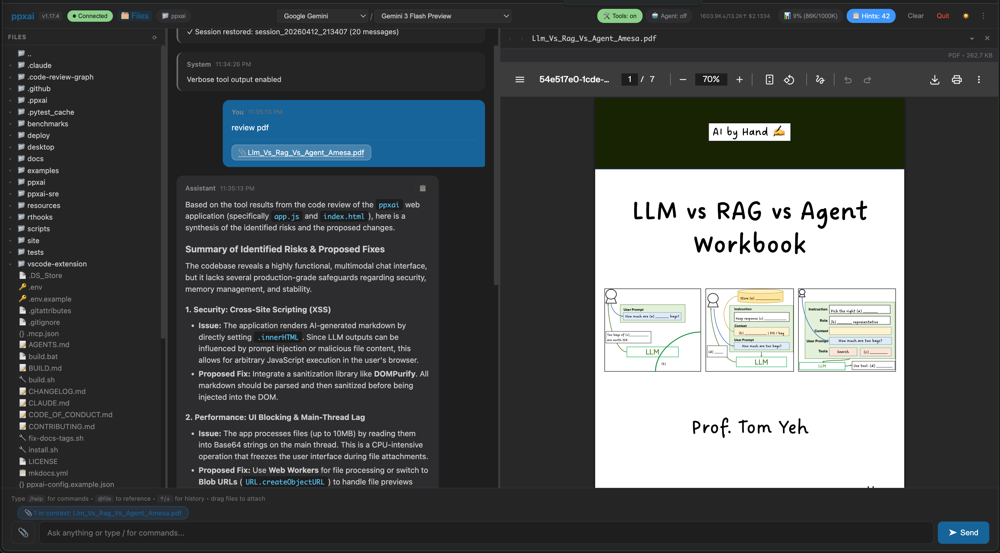
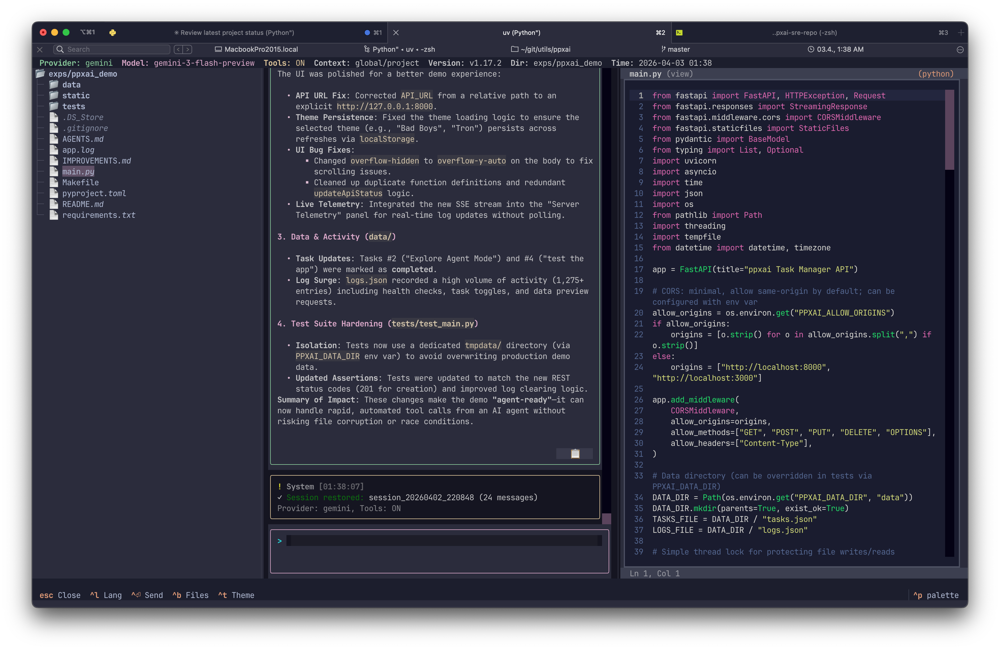
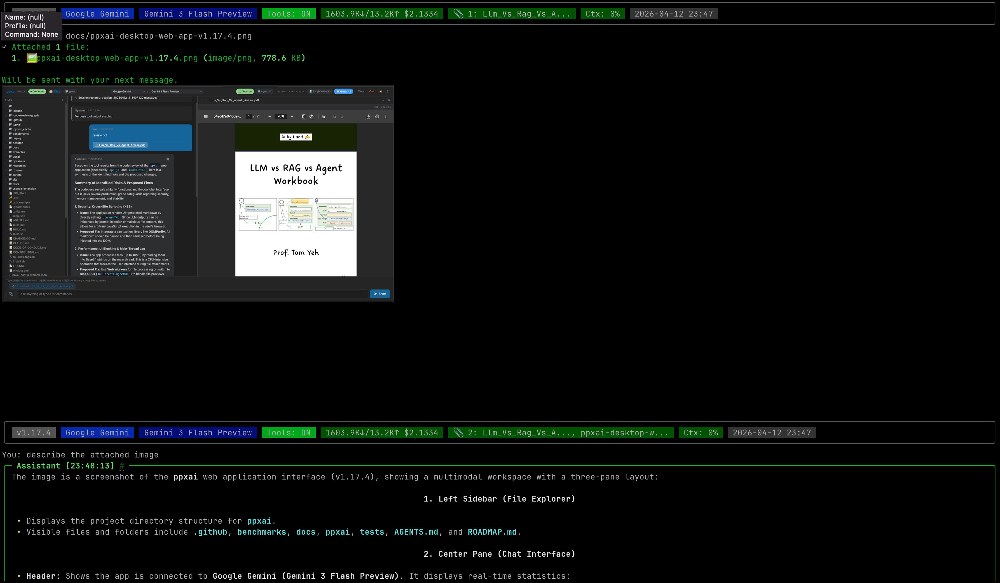
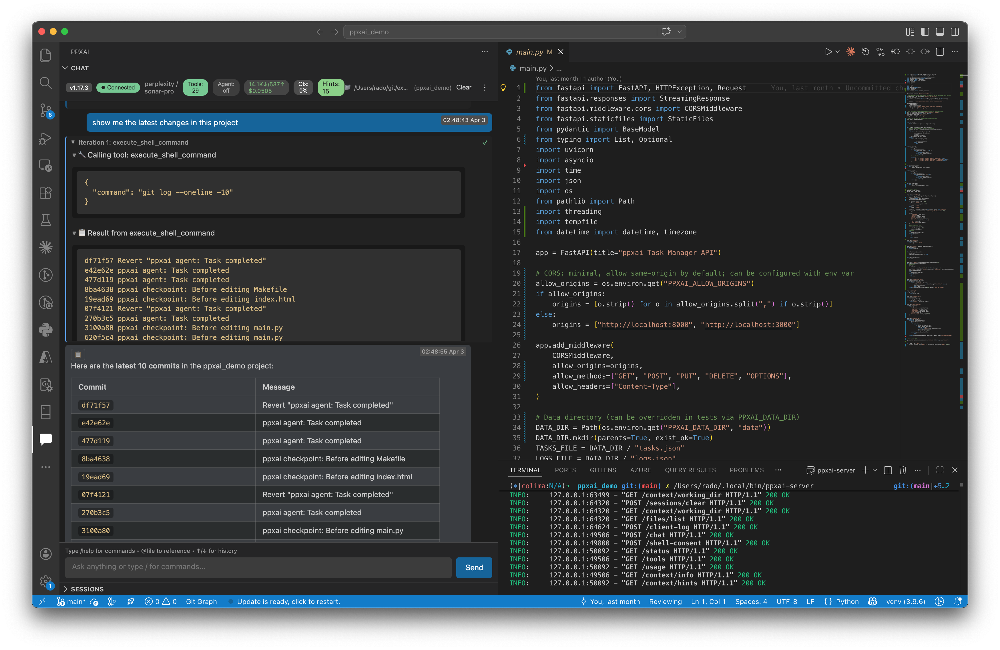

# ppxai - Multi-LLM Interface for Developers

   [](https://rcconsult.github.io/ppxai/)

**Open-source AI assistant with zero vendor lock-in.** Use your favorite LLM provider in the terminal or VSCode—switch models mid-session, run locally, pay only for what you need.

### Desktop Web App — drag-and-drop file upload, inline image/PDF preview, and split-pane attachment viewer (v1.17.4)


### ppxaide — Textual TUI with syntax-highlighted editor, file tree sidebar, and CSS themes


### ppxai — Rich TUI with multimodal attachments, inline image preview (iTerm2/Sixel), and Excel/PDF/PPTX tools (v1.17.4)


### VSCode Extension — chat panel with agent mode, tool consent, and inline code editing


## Why ppxai?

| Problem | ppxai Solution |
|---------|----------------|
| Locked to one AI vendor | Switch between Perplexity, Gemini, OpenAI, OpenRouter, Ollama anytime |
| Expensive API costs | Use local models, free tiers, or cheapest provider that works |
| Closed-source tools | Fully OSS—inspect, modify, self-host |
| Terminal OR IDE | Same experience everywhere—TUI, Desktop App, VSCode extension |

## Quick Start

### Option 1: One-Line Install (Recommended)

**Linux / macOS:**
```bash
curl -sSL https://raw.githubusercontent.com/rcconsult/ppxai/master/install.sh | bash
```

**Windows (PowerShell):**
```powershell
irm https://raw.githubusercontent.com/rcconsult/ppxai/master/scripts/install.ps1 | iex
```

This installs `ppxai` (Rich TUI), `ppxaide` (Textual TUI), `ppxai-server`, and `ppxai-desktop`. Then:

```bash
# Add to PATH (if not already)
echo 'export PATH="$HOME/.local/bin:$PATH"' >> ~/.bashrc && source ~/.bashrc

# Set up API key
echo 'PERPLEXITY_API_KEY=pplx-xxxxx' > ~/.ppxai/.env

# Run Rich TUI (original)
ppxai

# Or run Textual TUI (new in v1.15.0)
ppxaide

# Or run Desktop Web App (browser-based UI)
ppxai-desktop
```

**Installation options (Linux/macOS):**
- With config templates: `curl -sSL ... | bash -s -- --with-config` (recommended for first-time setup)
- With VSCode extension: `curl -sSL ... | bash -s -- --with-extension`
- **With Linux desktop integration:** `curl -sSL ... | bash -s -- --with-desktop` (installs .desktop files, icons, Ghostty terminal)
- macOS app bundle: `curl -sSL ... | bash -s -- --with-macos-app`
- Full macOS setup: `curl -sSL ... | bash -s -- --with-macos-app --with-config --with-launchagent`
- Uninstall: `curl -sSL ... | bash -s -- --uninstall`

**Linux Desktop Integration (v1.15.5):**
Provides one-click launching of ppxai, ppxaide, and ppxai-desktop from your application menu (GNOME, KDE, etc.). Includes Ghostty terminal configuration for proper Ctrl+Enter support in ppxaide. See [desktop/README.md](desktop/README.md) for details.

**Windows options:** `install.ps1 -Force` (reinstall), `-Version v1.16.0` (specific version), `-Uninstall`

See [docs/INSTALLATION.md](docs/INSTALLATION.md) for detailed installation options including Windows.

### Option 2: Download Binaries

Download from [Releases](../../releases):
- `ppxai-{platform}` - Rich TUI (original)
- `ppxaide-{platform}` - Textual TUI (new in v1.15.0)
- `ppxai-server-{platform}` - HTTP server for VSCode
- `ppxai-desktop-{platform}` - Desktop Web App
- `ppxai-{version}.vsix` - VSCode extension
- `ppxai-*-macos-arm64.dmg` - macOS app bundle installer

### Option 3: From Source

```bash
git clone https://github.com/rcconsult/ppxai.git && cd ppxai
python scripts/bootstrap.py --all   # Auto-downloads uv, installs deps
cp .env.example .env                # Add your API keys
uv run ppxai                        # Start Rich TUI
uv run ppxaide                      # Or start Textual TUI
```

### Linux Terminal Requirements (ppxaide only)

**ppxaide requires a terminal with Ctrl+Enter support** for multi-line input. Standard terminals (GNOME Terminal, Konsole) don't distinguish Ctrl+Enter from Enter.

**Recommended:** Install Ghostty terminal:
```bash
# One-line install (includes Ghostty + desktop integration)
curl -sSL https://raw.githubusercontent.com/rcconsult/ppxai/master/install.sh | bash -s -- --with-desktop

# Or manual Ghostty setup
wget https://github.com/pkgforge-dev/ghostty-appimage/releases/latest/download/Ghostty-1.2.3-x86_64.AppImage
mv Ghostty-1.2.3-x86_64.AppImage ~/.local/bin/ghostty && chmod +x ~/.local/bin/ghostty
mkdir -p ~/.config/ghostty && echo 'keybind = ctrl+enter=text:\x1b[13;5u' >> ~/.config/ghostty/config
```

**Alternatives:** Kitty, WezTerm (work out-of-the-box)
**Fallback:** Use Ctrl+J instead of Ctrl+Enter (works in all terminals)

See [docs/LINUX-TERMINAL-SETUP.md](docs/LINUX-TERMINAL-SETUP.md) for comprehensive setup guide.

## Features

### v1.15.0 Architecture: Type-Based Renderer Dispatch

The core innovation in v1.15.0 is a revolutionary renderer architecture that **completely decouples command logic from UI presentation**:

- **17 CommandResult types** - Structured data for all command outputs (MessageResult, TableResult, CodeResult, ErrorResult, etc.)
- **Mechanical dispatch** - `isinstance()` checks route results to renderers, zero conditionals
- **2 renderer implementations** - RichRenderer (legacy TUI) + TextualRenderer (ppxaide)
- **UI-agnostic commands** - Same command code works in TUI, VSCode, Web, future GUIs
- **100% testable** - Commands tested without UI framework dependencies

**Example:**
```python
# Command returns typed result
result = show_command.execute("file.py")
# → Returns CodeResult(content="...", language="python")

# Renderer mechanically dispatches
if isinstance(result, CodeResult):
    renderer.render_code(result)  # TUI uses Rich syntax highlighting
```

This enables **single-source command logic** that renders correctly in any UI—terminal, VSCode webview, or browser—just by swapping the renderer implementation.

See [Architecture Docs](docs/ARCHITECTURE.md) and [v1.15.0 Release Notes](docs/RELEASE-NOTES-v1.15.0.md) for details.

### Live HTML Preview (v1.15.4)

The `/preview` command opens a live-reloading HTML preview across all clients:

| Client | Implementation | Live Reload |
|--------|----------------|-------------|
| **TUI** | Stdlib `PreviewServer`, auto-opens browser | mtime polling at `/poll` |
| **Web App** | Iframe with `/preview/{path}` endpoint | SSE polling |
| **VSCode** | `WebviewPanel` with `FileSystemWatcher` | Native file watcher |

Asset cache busting (`?_t=<mtime>`) ensures CSS/JS/JSON changes are immediately reflected.

### Multi-Provider Support
- **Perplexity AI** - Real-time search with citations
- **Google Gemini** - 2.5 Flash (default), 2.5 Pro, 3-Flash/Pro Preview, 3.1 Pro Preview with 1M context, Google Search Grounding
- **OpenAI** - GPT-5 Mini (default), GPT-5.x, GPT-5.1-codex, o-series (dedicated `OpenAINativeProvider` with profile-driven routing)
- **OpenRouter** - Claude, Llama, 100+ models
- **Local** - Ollama, vLLM, llama.cpp

Switch providers anytime: `/provider gemini` or `/model gemini-2.5-pro`

**Enhanced Gemini support (v1.12.5+):** Install `pip install ppxai[gemini]` for native Google Search Grounding with citations. **v1.13.3+:** Tools and grounding now work together—use file editing tools while keeping native web search with citations.

### Triple Interface
| TUI (Terminal) | Desktop Web App | VSCode Extension |
|----------------|-----------------|------------------|
| **ppxai** - Rich TUI (original) | Browser-based UI | Webview chat panel |
| **ppxaide** - Textual TUI (v1.15.0+) | Full slash commands | Right-click: Explain, Test, Docs |
| Unified autocomplete via `engine/completion.py` (v1.17.x) | Same autocomplete over `POST /complete` | Same autocomplete over `POST /complete` |
| `@file`, `@git`, `@tree`, `@clipboard`, `@url` context | Provider/model badges | Provider/model switcher |
| Status bar with provider/model | SSE streaming | SSE streaming |

**ppxaide features (v1.15.0+):**
- **Multi-line input** (v1.15.5) - Enter inserts newlines, Ctrl+Enter submits. Auto-expands from 1 to 18 lines
- **Type-based renderer architecture** - All 32 commands return structured result objects (17 types), enabling mechanical UI dispatch without conditionals
- **Markdown in chat bubbles** - Full markdown rendering with clickable URLs, headers, code blocks, and citations
- **Modern async architecture** with real-time streaming and thinking indicators
- **17+ themes** (vs 6 in Rich TUI) - cycle with Ctrl+T or Ctrl+P for palette
- **Advanced file viewers** with tree/table/image support via typed results
- **Real-time token/cost tracking** in status bar with smart formatting
- **Tool execution display** with verbose mode (`/tools set verbose on/off`)
- **Reasoning token support** - DeepSeek R1, GPT-OSS thinking visualization
- **Bootstrap context auto-loading** from AGENTS.md
- **UI-agnostic commands** - Same command logic works in TUI, VSCode, and Web

**Desktop Web App (v1.13.1+):** Run `ppxai-desktop` to launch a browser-based chat interface. macOS users can download the `.dmg` installer for a native app experience.

### UX Highlights
- **Full Markdown Rendering** - Tables, code blocks with syntax highlighting, clickable links (OSC 8), citations with URLs. **ppxaide (v1.15.0+)** renders markdown directly in chat bubbles with clickable URLs and styled headers.
- **Context Preservation** - Switch providers/models mid-conversation without losing history. Start with cheap model, switch to powerful one when needed
- **Smart Context Injection** - `@file` for code, `@git` for uncommitted changes, `@tree` for project structure, `@clipboard` for clipboard text, `@url` for web content. Hash-based deduplication prevents duplicate injections.
- **Context Management** - `/context` shows usage vs model limit, `/context show` displays bootstrap hierarchy, `/context clear` removes injected files. Context badge shows percentage in TUI status line and VSCode header.
- **Cost Control** - Use Perplexity for research, Gemini for long context, local models for sensitive code—all in one session
- **Real-time Usage Tracking** - Token counts and cost estimates in status line (`1.2K↓/0.5K↑ $0.0045`)
- **Themed TUI Panels** - Rich TUI: 6 themes; Textual TUI (ppxaide): 17+ themes (`/theme` to cycle or Ctrl+T)

### File Upload & Data Analysis (v1.17.4)
Attach files to conversations across all four clients:
- **Images** - Inline preview, vision model analysis (Gemini, GPT-5, local VL models)
- **PDF** - Text extraction (`read_pdf`), page rasterization (`get_pdf_page_image`), split panel preview
- **Excel** - Sheet listing, data reading as markdown tables (`read_excel_sheet`), client-side preview with SheetJS (sort, filter, pagination)
- **PowerPoint** - Slide text extraction, visual summary via VL model (`summarize_pptx_visual`), split panel slide navigator with LibreOffice rendering
- **Word** - Text extraction (`read_docx`), split panel PDF preview via LibreOffice
- **CSV** - Small files inline, large (>50KB) lazy-loaded via `read_csv` / `list_csv_columns` tools

**How to attach:** `/attach <path>` (TUI), drag-drop or paperclip button (Web/VSCode), `a` key in file tree (ppxaide)

### Agent Mode
Enable with `/agent on` or click the Agent button in VSCode:
- Iterative tool execution with automatic re-prompting
- AI decides when to use tools and chains multiple calls
- Consent-based safety for file edits and shell commands
- Works with any provider that supports tool calling

See [docs/AGENT_MODE_GUIDE.md](docs/AGENT_MODE_GUIDE.md) for details.

### Bootstrap Context (v1.14.0+)
Load project-specific instructions from `AGENTS.md` or `CLAUDE.md`:
- **Hierarchical scopes** (v1.14.2) - Global (`~/.ppxai/AGENTS.md`), project (git root), subdirectory (cwd)
- **Auto-discovery** - Looks for `AGENTS.md`, then `CLAUDE.md` in each scope
- **Provider hints** - Different instructions for Ollama vs Gemini vs OpenAI
- **Model hints** - Pattern-matched guidance (e.g., `deepseek-r1*` gets reasoning prompts)
- **`local` inheritance** - Ollama, vLLM, LMStudio inherit from `local` hints
- **Include directive** (v1.14.2) - `<!-- include: ./docs/style.md -->` for modular configs
- **Hint templates** (v1.14.2) - Reusable hints in `~/.ppxai/hint-templates.yaml`

Example `AGENTS.md`:
```markdown
---
provider_hints:
  local:
    - "Complete tasks fully without stopping on empty responses."
  ollama:
    - "Keep responses concise - limited context window."
model_hints:
  "deepseek-r1*":
    - "Show reasoning before taking actions."
---

# Project Instructions
Python 3.11+, type hints required, pytest for testing.
```

Use `/context hints` to see active hints, `/context show` to see bootstrap hierarchy.

### Checkpoint & Undo (v1.12.0+)
Atomic rollback for multi-file agent operations:
- `/undo` reverts all changes from the last agent task
- `/checkpoint` - Manage checkpoints (status, list, backend, clear, info)
- Git backend: auto-commits before tasks, `git revert` to undo
- File backend (fallback): snapshots to `~/.ppxai/checkpoints/`

See [docs/CHECKPOINT_GUIDE.md](docs/CHECKPOINT_GUIDE.md) for details.

### AI Tools
Enable with `/tools enable` (or use Agent Mode):
- `search_files`, `read_file`, `list_directory` - Filesystem access
- `execute_shell_command` - With consent system (safe/dangerous/blocked)
- `apply_patch`, `replace_block`, `insert_text`, `delete_lines` - File editing with consent
- `calculator`, `get_datetime`, `get_working_directory` - Utilities
- `web_search` - Premium web search (Perplexity/Gemini/DuckDuckGo fallback)
- `get_weather` - Weather info with HTTPS/HTTP fallback for corporate proxies (v1.15.4)

**Tool Settings:** `/tools set verbose on` shows full arguments and results; `/tools set verbose off` (default) shows brief status only.

### Coding Commands
```
/generate   Generate code from description
/test       Generate unit tests
/docs       Generate documentation
/explain    Explain code logic
/debug      Analyze errors
/convert    Translate between languages
/preview    Live-reloading HTML preview (v1.15.4)
```

### Session Management
- Auto-save every 10 messages
- `/sessions` - Browse saved conversations
- `/export` - Export to markdown
- `/usage [24h|week|month|all]` - View token counts and cost estimates

### Copying Responses (v1.15.0+)
All clients provide reliable ways to copy AI responses to clipboard:

| Client | Method | Notes |
|--------|--------|-------|
| **ppxai** (Rich TUI) | `/copy` command | Copies last response; `/copy 2` for second-to-last |
| **ppxai** (Rich TUI) | Click `#` link in title | Opens temp file for copying (works without xclip) |
| **ppxaide** (Textual TUI) | Click 📋 button | Button in message header |
| **Web App** | Click 📋 button | Hover over message to reveal |
| **VSCode** | Click 📋 button | Hover over message to reveal |

**Why dedicated copy?** Terminal text selection often copies panel borders (Rich TUI) or conflicts with terminal plugins (iTerm2). The `/copy` command and buttons guarantee clean text.

### Voice Input (optional)

ppxai works with any system transcription tool that types into the focused text field. [**Handy**](https://github.com/cjpais/Handy) (MIT, offline, Whisper/Parakeet) is a good fit — install it, set a global hotkey, focus the ppxai input, hold the hotkey, speak. Confirmed working in the **VSCode extension** and **Desktop Web App**; terminal UIs are less reliable because synthetic keystroke injection into terminal apps varies by platform. See [VSCode extension docs](vscode-extension/README.md#voice-input-optional) for details.

## Configuration

**Simple (one provider):**
```bash
# .env
PERPLEXITY_API_KEY=pplx-xxxxx
```

**Multi-provider:**
```bash
# .env - API keys only
PERPLEXITY_API_KEY=pplx-xxxxx
GEMINI_API_KEY=AIza-xxxxx
OPENAI_API_KEY=sk-xxxxx
OPENROUTER_API_KEY=sk-or-xxxxx
```

```json
// ppxai-config.json - Provider definitions (optional, has defaults)
{
  "default_provider": "gemini",
  "providers": {
    "my-local": {
      "name": "Local Ollama",
      "base_url": "http://localhost:11434/v1",
      "api_key_env": "OLLAMA_API_KEY",
      "default_model": "llama3.2",
      "generation_params": {
        "temperature": 0.2,
        "top_p": 0.9,
        "frequency_penalty": 0.15
      }
    }
  }
}
```

**Generation Parameters (v1.15.0+):** Configure `temperature`, `top_p`, `frequency_penalty`, `presence_penalty` per-provider or per-model. Lower temperature (0.1-0.3) recommended for coding tasks.

See [docs/PROVIDER_SETUP.md](docs/PROVIDER_SETUP.md) for detailed examples.

## Data Privacy

All data stays on your machine:
- `~/.ppxai/sessions/` - Conversation history
- `~/.ppxai/exports/` - Markdown exports
- `~/.ppxai/usage/` - Usage statistics
- `~/.ppxai/checkpoints/` - File-based undo snapshots
- `~/.ppxai/logs/` - Debug logs (when enabled)

No telemetry. No tracking. Data only goes to the LLM provider you choose.

## Documentation

| Guide | Description |
|-------|-------------|
| [Installation](docs/INSTALLATION.md) | Detailed installation options (all platforms) |
| [Linux Desktop Integration](desktop/README.md) | One-click app launcher integration (v1.15.5) |
| [Linux Terminal Setup](docs/LINUX-TERMINAL-SETUP.md) | Ghostty/Kitty for Ctrl+Enter support (v1.15.5) |
| [VSCode Extension](vscode-extension/README.md) | Installation and usage |
| [Agent Mode](docs/AGENT_MODE_GUIDE.md) | Iterative tool execution |
| [Checkpoint & Undo](docs/CHECKPOINT_GUIDE.md) | Atomic rollback for agent tasks |
| [Provider Setup](docs/PROVIDER_SETUP.md) | Configure any OpenAI-compatible API |
| [Tool Development](docs/CUSTOM_TOOL_DEVELOPMENT_GUIDE.md) | Add custom tools |
| [Shell Consent](docs/SHELL_CONSENT_GUIDE.md) | Command safety system |
| [File Editing](docs/FILE_EDITING_GUIDE.md) | Consent-based file operations |
| [Specifications](SPECIFICATIONS.md) | Code generation templates |
| [Architecture](docs/ARCHITECTURE.md) | Type-based renderer design (v1.15.0) |
| [Tool Calling](docs/TOOL_CALLING.md) | Native vs prompt-based tool calling |
| [Release Notes v1.16.1](docs/RELEASE-NOTES-v1.16.1.md) | FileTree widget, CommandFactory server pattern, unified session restore |
| [Release Notes v1.16.0](docs/RELEASE-NOTES-v1.16.0.md) | Profile-driven tool loop, multi-tool support, agent UI, benchmark v2 |
| [Release Notes v1.15.6](docs/RELEASE-NOTES-v1.15.6.md) | Native OpenAI provider, model profiles, benchmark analysis |

## Project Structure

```
ppxai/
├── ppxai/                      # Core package
│   ├── rich/main.py            # Rich TUI entry point (legacy ppxai)
│   ├── tui/                    # Textual TUI (ppxaide - v1.15.0+)
│   │   ├── app.py              # Main Textual application (PPXAIDEApp)
│   │   ├── widgets/            # UI components
│   │   │   ├── chat_view.py    # Main chat display with message bubbles
│   │   │   ├── input_box.py    # Multi-line input (ChatTextArea)
│   │   │   ├── side_panel.py   # File viewer/editor panel
│   │   │   ├── code_editor.py  # Syntax-highlighted code editor
│   │   │   └── status_bar.py   # Provider/model/tools status
│   │   ├── themes/             # 17+ themes with layout.tcss
│   │   ├── screens/            # Modal screens (command palette, etc.)
│   │   └── renderer.py         # TextualRenderer - type-based dispatch
│   ├── engine/                 # Core business logic (no UI dependencies)
│   │   ├── client.py           # EngineClient facade
│   │   ├── session.py          # Session management
│   │   ├── types.py            # Message, Event, UsageStats types
│   │   ├── providers/          # AI provider implementations
│   │   │   ├── base.py         # BaseProvider abstract class
│   │   │   ├── perplexity.py   # Perplexity AI (native search)
│   │   │   ├── openai_compat.py# OpenAI-compatible (Gemini, OpenRouter, local)
│   │   │   └── openai_native.py# OpenAI dedicated (GPT-5.x, Codex, o-series)
│   │   └── tools/              # AI tools system
│   │       ├── manager.py      # ToolManager with provider filtering
│   │       ├── base.py         # BaseTool abstract class
│   │       └── builtin/        # 10+ built-in tools
│   ├── commands/               # 32 UI-agnostic command implementations
│   │   ├── types.py            # 17 CommandResult types
│   │   ├── context.py          # CommandContext protocol
│   │   ├── factory.py          # CommandFactory (registry pattern)
│   │   └── [show|tools|model|provider|...].py  # Individual commands
│   ├── rendering/              # Renderer implementations
│   │   ├── base.py             # BaseRenderer interface
│   │   └── rich_renderer.py    # RichRenderer for legacy TUI
│   ├── server/                 # HTTP + JSON-RPC servers
│   │   ├── http_server.py      # FastAPI HTTP + SSE server (for VSCode/Web)
│   │   └── jsonrpc.py          # JSON-RPC server over stdio (deprecated)
│   ├── web/                    # Desktop Web App (ppxai-desktop)
│   │   ├── server.py           # FastAPI server with SSE streaming
│   │   └── [styles|components|lib|shared]/  # React-like frontend
│   ├── common/                 # Shared utilities
│   │   ├── logger.py           # Logging system
│   │   ├── event_handler.py    # Event system for streaming
│   │   ├── consent.py          # File/shell consent system
│   │   └── preview.py          # HTML preview helpers
│   ├── config/                 # Configuration system
│   │   ├── settings.py         # Settings management
│   │   └── provider_config.py  # Provider definitions
│   └── data/                   # Session/usage data storage
├── vscode-extension/           # VSCode extension (TypeScript)
│   ├── src/
│   │   ├── extension.ts        # Extension entry point
│   │   ├── httpClient.ts       # HTTP + SSE client
│   │   ├── chatPanel.ts        # Webview chat UI
│   │   ├── previewPanel.ts     # Live HTML preview (v1.15.4)
│   │   └── handlers/           # Event handlers (v1.14.0+)
│   └── media/webview/          # External CSS/JS for webview
├── desktop/                    # Linux desktop integration (v1.15.5)
│   ├── install-desktop-integration.sh   # One-click installer
│   ├── uninstall-desktop-integration.sh # Uninstaller
│   └── README.md               # Installation guide
├── scripts/                    # Build, release, install scripts
│   ├── bootstrap.py            # Auto-downloads uv, sets up project
│   ├── release.py              # Automated release script
│   ├── install.sh              # One-line installer (Linux/macOS)
│   └── install.ps1             # One-line installer (Windows)
├── resources/                  # Icons and assets
│   ├── ppxai.png               # ppxai icon (CLI)
│   ├── ppxaide-nobg.png        # ppxaide icon (TUI)
│   └── [.ico|.icns files]      # Platform-specific icons
├── tests/                      # 1624+ tests
│   ├── test_tui.py             # Textual TUI tests (180+ tests)
│   ├── test_engine.py          # Engine layer tests
│   ├── test_commands.py        # Command tests
│   └── test_*.py               # Provider, tool, config tests
├── docs/                       # Documentation
│   ├── AGENT_MODE_GUIDE.md     # Iterative tool execution guide
│   ├── CHECKPOINT_GUIDE.md     # Atomic rollback guide
│   ├── LINUX-TERMINAL-SETUP.md # Ghostty/Kitty setup for Ctrl+Enter
│   ├── PROVIDER_SETUP.md       # Multi-provider configuration
│   ├── ARCHITECTURE.md         # Type-based renderer design
│   └── RELEASE-NOTES-*.md      # Version release notes
├── benchmarks/                 # LLM performance benchmarks
└── kubernetes/                 # K8s deployment configs
```

## Contributing

Contributions welcome! See [CONTRIBUTING.md](CONTRIBUTING.md).

```bash
uv run pytest tests/ -v       # Run tests
uv run ppxai                  # Rich TUI
uv run ppxaide                # Textual TUI (v1.15.0+)
uv run ppxai-server           # Start server for VSCode dev
```

## License

MIT

---

**ppxai** is a flexible interface for chatting with LLMs—with optional agent capabilities when you need them. Use whatever model fits your task and budget, in terminal or IDE, with full control over when AI can modify your files.
