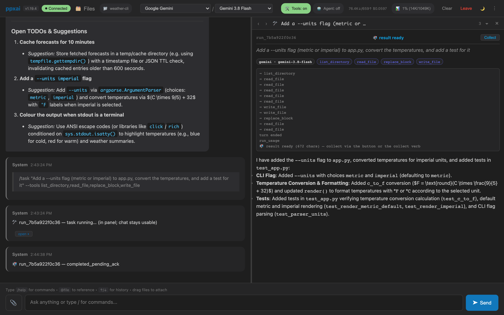
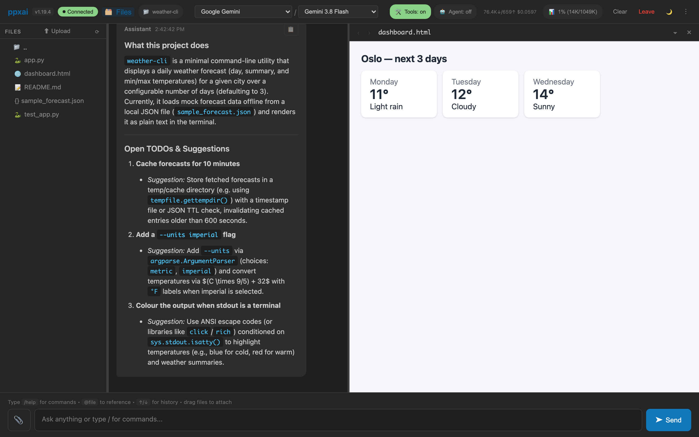
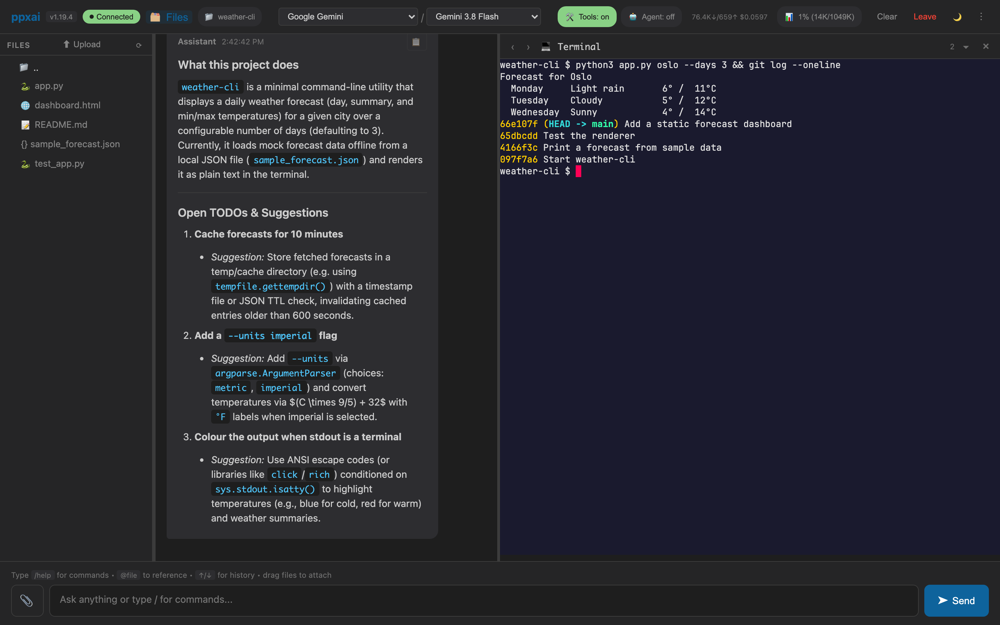
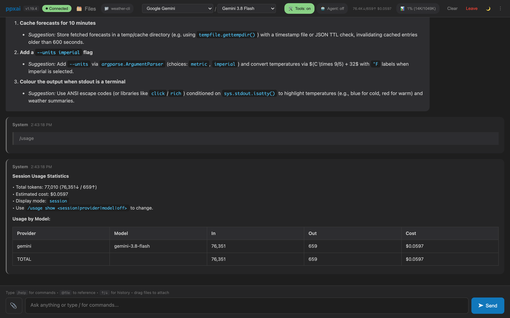
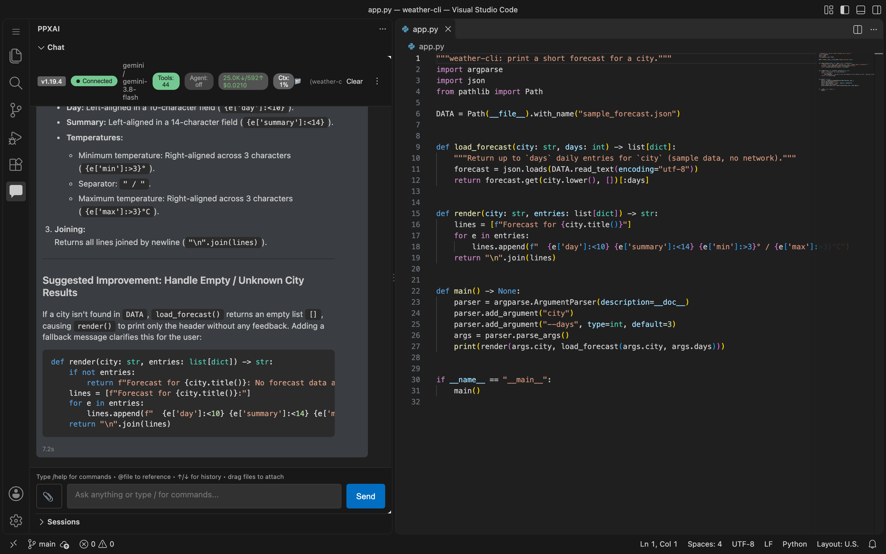

# ppxai — one AI workbench, any model, on your machine

   [](https://rcconsult.github.io/ppxai/)

Chat, edit code, and run background tasks against Gemini, OpenAI, OpenRouter, Anthropic, or a local model — from the same web app, VSCode extension, or terminal UI. Everything runs on your machine; only your chat traffic goes to the provider you pick.


## Why ppxai?

| Problem | ppxai solution |
|---------|----------------|
| Locked to one AI vendor | Switch between Gemini, OpenAI, OpenRouter, local models anytime (Anthropic too — opt-in, [untested against the live API](docs/ANTHROPIC-PROVIDER.md)) |
| Expensive API costs | Use local models, free tiers, or whichever provider is cheapest for the task |
| Closed-source tools | Fully open source — inspect, modify, self-host |
| Terminal OR IDE | Same commands and history in a TUI, the desktop app, or VSCode |

## Quick start

### Option 1: one-line install

**Linux / macOS:**
```bash
curl -sSL https://raw.githubusercontent.com/rcconsult/ppxai/master/install.sh | bash
```

**Windows (PowerShell):**
```powershell
irm https://raw.githubusercontent.com/rcconsult/ppxai/master/scripts/install.ps1 | iex
```

This installs `ppxai` (Rich TUI), `ppxaide` (Textual TUI), `ppxai-server`, and `ppxai-desktop` to `~/.local/bin/` (Linux/macOS) or `~/.ppxai/bin/` (Windows). Then:

```bash
# Add to PATH (Linux/macOS, if not already)
echo 'export PATH="$HOME/.local/bin:$PATH"' >> ~/.bashrc && source ~/.bashrc

# Set up an API key
echo 'GEMINI_API_KEY=your-key-here' > ~/.ppxai/.env
```

**Windows (PowerShell):** add the binaries directory to PATH:
```powershell
[Environment]::SetEnvironmentVariable("Path", "$env:USERPROFILE\.ppxai\bin;" + [Environment]::GetEnvironmentVariable("Path", "User"), "User")
```

```bash
ppxai              # Rich TUI (original)
ppxaide            # Textual TUI
ppxai-desktop      # Desktop web app
```

**Useful install flags (Linux/macOS):** `--with-config` (config templates), `--with-extension` (VSCode extension), `--with-desktop` (Linux desktop integration: launchers, icons, Ghostty terminal), `--with-macos-app` (macOS `.app` bundle), `--uninstall`.
**Windows:** `install.ps1 -Force` (reinstall), `-Version v1.19.3` (specific version), `-Uninstall`.

See [docs/installation.md](docs/installation.md) for the full option list, including Windows.

### Option 2: download binaries

Download from [Releases](https://github.com/rcconsult/ppxai/releases):
- `ppxai-{platform}` — Rich TUI
- `ppxaide-{platform}` — Textual TUI
- `ppxai-server-{platform}` — HTTP server for VSCode/Web
- `ppxai-desktop-{platform}` — Desktop web app
- `ppxai-{version}.vsix` — VSCode extension
- `ppxai-*-macos-arm64.dmg` — macOS app bundle installer

### Option 3: from source

```bash
git clone https://github.com/rcconsult/ppxai.git && cd ppxai
python scripts/bootstrap.py --all   # Auto-downloads uv, installs deps
cp .env.example .env                # Add your API keys
uv run ppxai                        # Start Rich TUI
uv run ppxaide                      # Or start Textual TUI
```

### Linux terminal note (ppxaide only)

`ppxaide` needs a terminal that distinguishes Ctrl+Enter from Enter for multi-line input. GNOME Terminal and Konsole don't. Ghostty, Kitty, and WezTerm work out of the box:

```bash
# One-line install with Ghostty + desktop integration
curl -sSL https://raw.githubusercontent.com/rcconsult/ppxai/master/install.sh | bash -s -- --with-desktop
```

Fallback in any terminal: use Ctrl+J instead of Ctrl+Enter. See [docs/linux-terminal-setup.md](docs/linux-terminal-setup.md).

## What you can do

### Chat with any model

- **Providers:** Google Gemini (default, `gemini-3.8-flash`), OpenAI (`gpt-5.6-terra` and the GPT-5.x line), OpenRouter (100+ models including Claude), Anthropic (opt-in via the `[anthropic]` extra), local models (Ollama, vLLM, llama.cpp). Perplexity is **not** a chat provider — it's a web-search/grounding backend only.
- **Switch mid-session:** `/provider gemini` or `/model gpt-5.6-terra` — conversation history carries over, so you can start cheap and move to a stronger model when needed.
- **Smart context injection:** `@file`, `@git`, `@tree`, `@clipboard`, `@url` pull content into the prompt; `/context` shows usage against the model's limit.
- **Sessions:** saved automatically after every message (`session.auto_save_interval`); `/sessions` browses saved conversations, `/export` writes one to markdown, `/usage` shows token counts and cost.
- **Copy a response** with `/copy` (TUI) or the copy button (Web/VSCode/ppxaide) — more reliable than terminal text selection, which can grab panel borders.
- **Voice input:** works with any system transcription tool that types into the focused field (e.g. [Handy](https://github.com/cjpais/Handy), offline Whisper/Parakeet). Confirmed working in VSCode and the desktop web app; less reliable in terminal UIs. See [vscode-extension/README.md](vscode-extension/README.md#voice-input-optional).

### Let it work on your code

- **Tools with consent:** file search/read/write, shell commands, and code editing tools, each gated by a consent prompt (safe/dangerous/blocked). Turn them on with `/tools on` or the Tools badge.
- **`/auto`** runs an in-session agent loop: the model chains tool calls and re-prompts itself until the task is done, still asking consent for file edits and shell commands. See [docs/session-agent-guide.md](docs/session-agent-guide.md).
- **Checkpoints & undo:** `/undo` reverts everything from the last agent task. The git backend auto-commits before a task and reverts on undo; the file backend (fallback) snapshots to `~/.ppxai/sessions/checkpoints/<session_id>/`. See [docs/checkpoint-guide.md](docs/checkpoint-guide.md).
- **Coding commands:** `/generate`, `/test`, `/docs`, `/explain`, `/debug`, `/convert`, `/implement` (alias `/impl`) turn a description or a file into generated code, tests, docs, or an explanation.
- **Bootstrap context:** drop project instructions in `AGENTS.md` (or `CLAUDE.md`) at the global, project, or subdirectory level — provider hints (e.g. different instructions for Ollama vs. Gemini) and model hints (pattern-matched, e.g. `deepseek-r1*` gets a reasoning prompt) load automatically. `/context hints` shows what's active.

### Run work in the background

- **`/task "<description>" --tools read_file,search_files [--spec name] [--work-dir path]`** launches a durable, addressable background run with its own tool grant and working directory; it keeps running while you chat, and its result waits for you to collect it. `/task ls|get|watch|respond|collect|resume|cancel` manages it; `collect` retrieves a held result. Off until you set `execution.task.enabled`; the web and VSCode clients also need a `/v1` token (`/token mint`).
- **`/run <prompt>`** is the tool-free, one-off sibling: no flags, just a prompt and an answer. `/run ls|get|watch|collect|cancel`.
- Both ship in all four clients (Web, VSCode, `ppxaide`, `ppxai`); the Rich TUI has no live event loop, so it serves every read verb but declines `launch`/`resume`.



See [docs/task-agent-guide.md](docs/task-agent-guide.md) for spec files, skills, egress allowlists, and budgets.

### Work with files

- **Attach** files with `/attach <path>` (TUI), drag-and-drop or the paperclip button (Web/VSCode), or the `a` key in the `ppxaide` file tree.
- **Images** — inline preview, vision-model analysis. **PDF** — text extraction and page rasterization with split-panel preview. **Excel** — sheet listing and markdown-table reads, with client-side sort/filter/pagination. **PowerPoint** — slide text extraction, visual summary via a VL model, split-panel slide navigator. **Word** — text extraction with a rendered PDF preview. **CSV** — small files inline, large ones lazy-loaded.
- **Live HTML preview:** `/preview` opens a live-reloading preview of an HTML file across every client (a stdlib server for the TUIs, an iframe for Web, a `WebviewPanel` for VSCode).



### Use a terminal

In the web app and VSCode, `/terminal` opens a real shell pane beside the chat, in the session's working directory. In the terminal UIs it shows your terminal's capabilities instead.



### Know what it costs

- **`/usage [24h|week|month|year|all]`** shows token counts and cost estimates per model for the session or a time window.
- **`/doctor`** audits your config: flags deprecated keys (and what they cost you), dead settings, and recommended model upgrades.



### Integrate

- **`POST /v1/oneshot`** — the stable, semver-versioned gateway for a single prompt-in/answer-out call, with optional search grounding. Byte-identical wire shape since v1.18.4. See [docs/api-gateway.md](docs/api-gateway.md).
- **`/v1/agent/*`** — the background run-registry API behind `/task` and `/run`. Still evolving; not yet a stable contract.

## Four ways to use it

- **Web / desktop app** — run `ppxai-server` and open the browser UI, or run `ppxai-desktop` for a standalone window (macOS also ships a `.dmg`).
- **VSCode extension** — chat panel, inline code actions (Explain, Test, Docs), tool consent in the editor.

  
- **`ppxaide`** — Textual TUI: multi-line input, 17+ themes, syntax-highlighted file/code viewers.
- **`ppxai`** — Rich TUI: the original terminal interface, 4 themes.

All four share the same commands, the same autocomplete, and the same session history.

## Configure

**Simple (one provider):**
```bash
# ~/.ppxai/.env
GEMINI_API_KEY=your-key-here
```

(`PERPLEXITY_API_KEY` is optional — Perplexity is a web-search/grounding backend, not a chat provider.)

**Multiple providers:**
```bash
# ~/.ppxai/.env - API keys only
PERPLEXITY_API_KEY=pplx-xxxxx
GEMINI_API_KEY=AIza-xxxxx
OPENAI_API_KEY=sk-xxxxx
OPENROUTER_API_KEY=sk-or-xxxxx
```

```json
// ~/.ppxai/ppxai-config.json - provider definitions (optional, has defaults)
{
  "default_provider": "gemini",
  "providers": {
    "my-local": {
      "name": "Local Ollama",
      "base_url": "http://localhost:11434/v1",
      "api_key_env": "OLLAMA_API_KEY",
      "default_model": "llama3.2",
      "generation_params": {
        "temperature": 0.2,
        "top_p": 0.9,
        "frequency_penalty": 0.15
      }
    }
  }
}
```

Per-provider or per-model generation parameters (`temperature`, `top_p`, `frequency_penalty`, `presence_penalty`) are supported; lower temperature (0.1–0.3) is recommended for coding tasks.

**Behind a corporate proxy?** Set your CA bundle once (`network.ssl.cert_file` in `ppxai-config.json`) — it's *added to* the system trust store, so internal and public hosts both verify. Run `/doctor` to confirm which rule applied. See [docs/installation.md](docs/installation.md).

See [docs/provider-setup.md](docs/provider-setup.md) for more examples.

## Privacy

All data stays on your machine:
- `~/.ppxai/sessions/` — conversation history
- `~/.ppxai/exports/` — markdown exports
- `~/.ppxai/usage/` — usage statistics
- `~/.ppxai/sessions/checkpoints/` — file-based undo snapshots
- `~/.ppxai/logs/` — debug logs (when enabled)

No telemetry, no tracking. Data only goes to the LLM provider you choose.

## Documentation

| Guide | Description |
|-------|-------------|
| [Installation](docs/installation.md) | Detailed installation options (all platforms) |
| [Linux Desktop Integration](desktop/README.md) | One-click app launcher integration |
| [Linux Terminal Setup](docs/linux-terminal-setup.md) | Ghostty/Kitty for Ctrl+Enter support |
| [VSCode Extension](vscode-extension/README.md) | Installation and usage |
| [Session Agent Mode](docs/session-agent-guide.md) | In-session iterative tool execution (`/auto`) |
| [Task Agent Guide](docs/task-agent-guide.md) | Background `/task` agent platform |
| [Checkpoint & Undo](docs/checkpoint-guide.md) | Atomic rollback for agent tasks |
| [Provider Setup](docs/provider-setup.md) | Configure any OpenAI-compatible API |
| [Tool Development](docs/custom-tool-development-guide.md) | Add custom tools |
| [Shell Consent](docs/shell-consent-guide.md) | Command safety system |
| [File Editing](docs/file-editing-guide.md) | Consent-based file operations |
| [Specifications](SPECIFICATIONS.md) | Code generation templates |
| [Architecture](docs/architecture.md) | Layered design, module hierarchy, renderer dispatch |
| [API Gateway](docs/api-gateway.md) | `POST /v1/oneshot` — the stable external surface |
| [Tool Calling](docs/tool-calling.md) | Native vs. prompt-based tool calling |
| [Latest Release Notes](docs/release-notes-v1.19.3.md) | v1.19.3 is the latest release — see `docs/release-notes-v1.19.*.md` for the series |
| [CHANGELOG](CHANGELOG.md) | Full version history |
| [Archived Release Notes](docs/archive/release-notes) | Older release notes |

## Contributing

Contributions welcome! See [CONTRIBUTING.md](CONTRIBUTING.md).

```bash
uv run pytest tests/ -v       # Run tests
uv run ppxai                  # Rich TUI
uv run ppxaide                # Textual TUI
uv run ppxai-server           # Start server for VSCode dev
```

## License

MIT

---

**ppxai** is a flexible interface for chatting with LLMs — with optional agent capabilities when you need them. Use whatever model fits your task and budget, in a terminal, a browser, or your IDE, with full control over when AI can modify your files.
