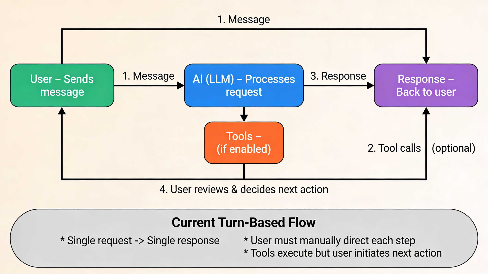

# ppxai Development Roadmap

> **Note:** For future roadmap, see:
> - **[docs/v1.11.0-agentic-workflow-plan.md](docs/v1.11.0-agentic-workflow-plan.md)** - **Agentic workflow plan (Phases 1-4 complete, Phase 5 `/agent` next)**
> - [gemini3-features-roadmap.md](gemini3-features-roadmap.md) - Agentic features vision (v1.11.0-v1.13.0)
> - [docs/tui-markdown-rendering.md](docs/tui-markdown-rendering.md) - TUI Workspace vision (v1.10.5-v1.15.0)
> - [sonar-features-proposal.md](sonar-features-proposal.md) - Competitive analysis

---

## Next Release: v1.11.8 (In Progress)

**Status**: 🔧 Agent Loop Implementation

**Branch**: `feature/adding-agent-loop`

**Goal**: Implement `/agent` command for autonomous multi-step task execution

**Workflow Diagrams**: See [docs/v1.11.0-agentic-workflow-plan.md](docs/v1.11.0-agentic-workflow-plan.md#workflow-diagrams)

| Workflow | Diagram |
|----------|---------|
| Current (turn-based) |  |
| Agent loop (autonomous) |  |

**New Features**:
- 🔧 **`/agent <task>`** - Autonomous multi-step task execution (max 5 iterations)
- 🔧 **`/tools agent on|off`** - Enable/disable agent mode in TUI
- 🔧 **Agent mode toggle** - VSCode extension UI button for agent mode
- 🔧 **Agent events** - `AGENT_ITERATION`, `AGENT_COMPLETE`, `AGENT_MAX_ITERATIONS`

**Implementation Progress**:
- ✅ 3 new EventTypes in `ppxai/engine/types.py`
- ✅ `agent_mode` property in EngineClient
- ✅ `/tools agent on|off` subcommand
- ✅ `handle_agent()` method in commands.py
- ✅ `/agent` command registration
- ✅ Autocomplete entries for `/agent` and `/tools agent`
- ✅ TUI event handlers for agent events
- ✅ HTTP endpoints (`/agent/enable`, `/agent/disable`, `/agent/status`)
- ✅ VSCode httpClient methods
- ✅ VSCode agent toggle button

**Files Modified**:
- `ppxai/engine/types.py` - 3 new EventTypes
- `ppxai/engine/client.py` - agent_mode property and methods
- `ppxai/commands.py` - /agent command and /tools agent subcommand
- `ppxai/main.py` - autocomplete entries
- `ppxai/common/event_handler.py` - TUI agent event handlers
- `ppxai/server/http.py` - HTTP endpoints for agent mode
- `vscode-extension/src/httpClient.ts` - client methods
- `vscode-extension/src/chatPanel.ts` - UI toggle button

**Tests**: 337 passed (awaiting agent-specific tests)

**Documentation**:
- **[docs/AGENT_MODE_GUIDE.md](docs/AGENT_MODE_GUIDE.md)** - User guide with practical examples for research and development workflows

---

## Current Release: v1.11.8

**Status**: ✅ Legacy Removal + Clickable Citations

Released: 2025-12-26

**Goal**: Complete legacy code removal and fix citation/link rendering

**Major Changes**:
- ✅ **Legacy Code Removed** - All legacy code paths removed, EngineClient is now the only client
  - Deleted: `ppxai/client.py` (447 lines - AIClient)
  - Deleted: `perplexity_tools_prompt_based.py` (1,342 lines - legacy tools client)
  - Deleted: `tool_manager.py` (299 lines - legacy MCP loader)
  - ~2,100 lines of legacy code removed
- ✅ **Tests Migrated** - Legacy tests replaced with EngineClient-based tests (337 passing)

**New Features**:
- ✅ **`/tools help <tool-name>`** - Detailed tool documentation command
- ✅ **Autocomplete for `/tools`** - Tab completion for subcommands and tool names
- ✅ **Custom Tool Development Guide** - [docs/CUSTOM_TOOL_DEVELOPMENT_GUIDE.md](docs/CUSTOM_TOOL_DEVELOPMENT_GUIDE.md)

**Bug Fixes**:
- ✅ **Perplexity Citations Clickable** - `inject_citation_urls()` converts `[1]` to `[1](url)` format
- ✅ **TUI Links Clickable** - OSC 8 hyperlinks via `convert_markdown_links_to_rich()`
  - Works in Ghostty, iTerm2, Kitty, Windows Terminal, GNOME Terminal 3.26+
- ✅ **VSCode Tool Responses** - Added `fullResponse` message type for tool-using responses
- ✅ **`/tools list` After Provider Switch** - Now correctly lists tools after `/provider gemini`
- ✅ **Tool JSON Leak** - No longer leaks to VSCode during streaming

**Documentation**:
- ✅ Archived legacy documentation
- ✅ Updated all guides for EngineClient architecture
- ✅ Autocomplete documentation across all relevant guides

**Agentic Workflow Progress**:
- ✅ Phase 1: File editing tools (v1.11.0)
- ✅ Phase 2: @git context (v1.11.4)
- ✅ Phase 3: @tree context (v1.11.4)
- ✅ Phase 4: Manual testing (v1.11.5-v1.11.7)
- 🔧 Phase 5: `/agent` command (v1.11.8 - **in progress**)
- ⏳ Phase 6: Testing & docs (v1.11.8)

**Branch**: `refactor/maintenance-no-legacy-code` → `master`

---

## Previous Release: v1.11.6

**Status**: ✅ Legacy Code Removal + Bug Fixes

Released: 2025-12-26

**Goal**: Complete legacy code cleanup and fix tool-related bugs

**Major Changes**:
- ✅ **Legacy Code Removed** - All legacy code paths removed
- ✅ **Tests Migrated** - Legacy tests replaced with EngineClient-based tests

**Bug Fixes**:
- ✅ **`/tools list` After Provider Switch** - Now correctly lists tools after `/provider gemini`
- ✅ **`/tools status` After Provider Switch** - Now correctly shows "Tools enabled" after switching

**Branch**: `refactor/maintenance-no-legacy-code` → `master`

---

## Previous Release: v1.11.5

**Status**: ✅ Bug Fixes - Ctrl-C and Tools Status Display

Released: 2025-12-26

**Goal**: Fix critical TUI bugs discovered during Linux testing

**Bug Fixes**:
- ✅ **Ctrl-C Message Alternation Error** - Fixed 400 error after Ctrl-C interrupt
  - Root cause: Ctrl-C cleanup only removed user message from legacy `client.conversation_history`, not from `engine_client.session.messages`
  - Fix: Added `SessionManager.remove_last_message()` method and cleanup logic for both legacy and engine session
  - Impact: No more "user or tool message(s) should alternate with assistant message(s)" errors after interrupting
- ✅ **Tools Status Display** - `/tools enable` now correctly shows "ON" in status line
  - Root cause: `get_status_line()` checked legacy `client.enable_tools` instead of `engine_client.tools_enabled`
  - Fix: Check `handler.engine_client.tools_enabled` first, fallback to legacy client check
  - Impact: Status bar accurately reflects tools state

**Files Changed**:
- `ppxai/engine/session.py` - Added `remove_last_message()` method (lines 82-95)
- `ppxai/main.py` - Updated Ctrl-C handler (lines 331-344), fixed `get_status_line()` (lines 35-43)
- `tests/test_file_editing_tools.py` - Added 2 new tests for `remove_last_message` functionality

**Testing**:
- 377 tests passing (2 new session cleanup tests)
- Manual TUI verification confirmed both bugs fixed

**Branch**: `bugfix/tools-errors-after-sync` → `master`

---

## Previous Release: v1.11.4

**Status**: ✅ @git and @tree Context Injection + Unified Architecture

Released: 2025-12-24

**Goal**: Implement context injection for git changes and project structure, unify TUI/VSCode architecture

**New Features**:
- ✅ **@git Context Injection** - Automatically inject git diff when you type `@git`
  - Captures both staged and unstaged changes
  - Formatted with headers: "=== Staged Changes ===" and "=== Unstaged Changes ==="
  - Shows "No changes in working directory" when clean
  - Returns None when not in a git repository
- ✅ **@tree Context Injection** - Automatically inject directory tree when you type `@tree`
  - Recursive tree generation with ASCII art (├── └── │)
  - Respects common ignore patterns (.git, __pycache__, node_modules, .venv, etc.)
  - Configurable max_depth (default: 3 levels)
  - Shows project stats: directories count, files count
- ✅ **Combined Context** - Use `@file`, `@git`, and `@tree` together in one message
  - Example: "Based on @tree, review @git changes to @src/main.py"
  - AI receives all three contexts: tree + git diff + file content
- ✅ **TUI Feedback** - Shows what was injected with formatted size
  - Example: "→ Injected context: @git (31 B)"
  - Displays for all three: @file, @git, @tree

**Architecture Changes**:
- ✅ **Unified TUI and VSCode** - Both always use EngineClient (shared engine)
  - Before: TUI sometimes used legacy code path, VSCode always used EngineClient
  - After: Both use EngineClient path exclusively (no dual routing)
- ✅ **EngineClient Always Available** - Created at TUI startup, not just when tools enabled
  - Context injection works regardless of tools ON/OFF state
  - Simplified _enable_tools()/_disable_tools() - just toggle tools, keep engine alive
- ✅ **Event-Based Context Display** - TUIEventHandler shows CONTEXT_INJECTED events
  - Formats size nicely (B, KB, MB)
  - Consistent with other event types (TOOL_CALL, TOOL_RESULT, etc.)

**Files Changed**:
- `ppxai/engine/context.py` - Added `inject_git_context()` and `inject_tree_context()` methods (lines 231-367)
- `ppxai/commands.py` - EngineClient created in `__init__()` (lines 204-231), always available
- `ppxai/main.py` - Always use EngineClient path, removed dual routing (lines 260-307)
- `ppxai/common/event_handler.py` - TUIEventHandler displays CONTEXT_INJECTED events (lines 211-233)
- Version updates: `pyproject.toml`, `ppxai/__init__.py`, `vscode-extension/package.json`
- `tests/test_context_injection.py` - Added 9 new @git/@tree tests (now 31 total)
- `docs/CONTEXT-INJECTION.md` - NEW comprehensive user guide
- `bug-tui-tool-call-20251224.txt` - Bug analysis and fix documentation

**Testing**:
- 31/31 context injection tests passing (9 new @git/@tree tests)
- 70/70 command tests passing
- Manual TUI verification confirmed @git and @tree work correctly
- Integration tests: Direct ContextInjector + full TUI path verified

**Performance**:
- TTFT: 1443ms (0.86x baseline - **14% improvement**)
- Total: 2772ms (0.85x baseline - **15% improvement**)
- Throughput: 51.4 tokens/sec
- No performance regression

**Bug Fixes**:
- ✅ Fixed @git fuzzy-matching to .gitignore (was incorrectly treating @git as filename)
- ✅ Fixed context injection only working when tools enabled (now works always)
- ✅ Fixed dual code path in TUI (now uses unified EngineClient exclusively)

**Branch**: `feature/git-tree-context-injections` → `master`

**Documentation**: See [docs/CONTEXT-INJECTION.md](docs/CONTEXT-INJECTION.md) for usage guide and examples.

---

## Previous Release: v1.11.3

**Status**: ✅ Foundation Refactoring + Critical Bugfixes (Consolidates v1.11.2.1 + v1.11.2.2)

Released: 2025-12-24

**Goal**: Iron out provider abstraction issues and fix critical TUI bugs before adding more features

**Features**:
- ✅ **Configurable Default Provider** - No more hardcoded "perplexity"
  - `DEFAULT_PROVIDER` environment variable support
  - `get_default_provider()` function with smart fallback chain
  - Falls back to: env var → first available → perplexity
- ✅ **Provider-Specific Pricing** - Each provider has its own pricing
  - `get_model_pricing(provider)` function for any provider
  - Backward compatible: `MODEL_PRICING` global still exists
- ✅ **AIClientWithTools Alias** - Better naming for provider-agnostic class
  - `AIClientWithTools` = `PerplexityClientPromptTools` (same class)
  - Updated docstring: "works with ALL providers"
  - Both names work for backward compatibility

**Bug Fixes** (from branch `bugfix/gemini-tool-calling`):
- ✅ **Tools Status Persistence** - Tools now stay ON when switching providers
  - Before: `/tools enable` on Perplexity → switch to Gemini → Tools OFF ❌
  - After: Tools remain ON across provider switches ✅
- ✅ **Gemini Tool Call Parsing** - Fixed nested JSON parsing failure
  - Before: Gemini showed raw JSON instead of executing tools ❌
  - After: Gemini tool calls execute correctly ✅
  - Root cause: Regex pattern broke on nested `arguments` object

**Files Changed**:
- `ppxai/config.py` - Added `get_default_provider()` and `get_model_pricing(provider)`
- `ppxai/commands.py` - Use configurable default, tools persistence fix (lines 388-420)
- `perplexity_tools_prompt_based.py` - Gemini JSON fix (lines 1054-1083), AIClientWithTools alias
- `.env.example` - Document `DEFAULT_PROVIDER` option
- Version updates: `pyproject.toml`, `ppxai/__init__.py`, `vscode-extension/package.json`, `ROADMAP.md`, `README.md`
- `tests/test_provider_tools_bugfixes.py` - NEW 4 regression tests
- `docs/BUGFIX-gemini-tool-calling.md` - NEW bug analysis
- `docs/PROVIDER-TOOLS-COMPATIBILITY.md` - NEW provider tools guide
- `docs/PROVIDER-ABSTRACTION-REFACTORING.md` - NEW refactoring analysis
- `docs/RELEASE-NOTES-v1.11.2.2.md` - NEW comprehensive release notes

**Testing**:
- 4/4 new regression tests passing (provider tools bugfixes)
- Manual TUI testing confirms both bugs fixed

**Impact**:
- ✅ Adding new providers now requires ZERO code changes (config-only)
- ✅ Tools work correctly with all providers (Perplexity, Gemini, OpenAI, OpenRouter, Ollama)
- ✅ Solid foundation for v1.12.0+ features

**Branch**: `bugfix/gemini-tool-calling` → `master`

**Version Consolidation Note**: ⚠️ This release consolidates v1.11.2.1 and v1.11.2.2 into v1.11.3 because **VSCode extensions only support 3-part semantic versioning** (`major.minor.patch`). The VSCode extension build failed with "Invalid extension version '1.11.2.2'" error. Future releases will use 3-part versions only (1.11.3 → 1.11.4 → 1.12.0).

---

## v1.11.1

**Status**: ✅ Critical Bugfix - TUI Event-Based Streaming

Released: 2025-12-22

**Goal**: Fix critical v1.11.0 regression and unify TUI/VSCode architecture

**Fixed Issues**:
- ✅ **TUI Response Display** - AI responses now show when tools enabled (v1.11.0 regression)
- ✅ **Unified Architecture** - Both TUI and VSCode use event-based streaming
- ✅ **Event Handling** - TUI handles STREAM_CHUNK, TOOL_CALL, TOOL_RESULT, CONSENT_REQUEST, ERROR
- ✅ **Real-time UX** - TUI shows streaming chunks, tool calls, consent prompts in real-time
- ✅ **Performance Validated** - EngineClient is 16.5% faster than legacy (2446ms vs 2929ms)
- ✅ **Conversation History Sync** - Fixed 400 error when using tools with conversation history
- ✅ **Inline Markdown in Tables** - File names and code render properly in table cells (backticks, bold, italic)
- ✅ **No Regression** - 296/301 tests passing (same as v1.11.0)

**New Features**:
- ✅ **Verbose Tool Logging** - `/tools set verbose on/off` to inspect tool inputs/outputs

**Root Cause**: v1.11.0 switched TUI to use `EngineClient.chat_sync()` which returns a plain string without rendering (pure function), but forgot to add console output.

**Solution**: Refactored TUI to use async event stream like VSCode extension, eliminating architectural divergence.

**Files Changed**:
- `ppxai/main.py` - Added event-based streaming loop (lines 268-335), conversation history sync
- `ppxai/commands.py` - Added conversation history sync (lines 541-549, 330-335), verbose tool logging (lines 134, 495, 665-698)
- `ppxai/markdown_tables.py` - Added inline markdown parsing for table cells (lines 16-68, 135)
- `pyproject.toml` - Version 1.11.0 → 1.11.1
- `vscode-extension/package.json` - Version 1.11.0 → 1.11.1
- `README.md`, `vscode-extension/README.md`, `docs/README.md` - Updated version references
- `CLAUDE.md` - Documented v1.11.1 changes
- `CHANGELOG.md` - Added comprehensive v1.11.1 entry

**Testing**:
- 296/301 tests passing
- 5 failures are pre-existing custom endpoint integration issues (unrelated)

**Branch**: `bugfix/tui-engineclient-adapter`

---

## Previous Release: v1.11.0

**Status**: ✅ Phase 1 Complete - File Editing Tools with Consent

Released: 2025-12-21

**Detailed Implementation Plan**: [docs/v1.11.0-agentic-workflow-plan.md](docs/v1.11.0-agentic-workflow-plan.md)

**Goal**: Transform ppxai from turn-based chatbot into autonomous developer agent

**Known Issue**: TUI doesn't display AI responses when tools enabled (fixed in v1.11.1)

**Phase 1 Completed Features**:
- ✅ **Native File Editing Tools** - Safe, atomic file editing (apply_patch, replace_block, insert_text, delete_lines)
- ✅ **User Consent System** - Per-file session consent (y/n/always/never) in both TUI and VSCode
- ✅ **TUI Consent Prompts** - Interactive validation with prompt_toolkit
- ✅ **Event-Driven SSE Consent** - Server-Sent Events for VSCode modal dialogs
- ✅ **Atomic File Operations** - Automatic rollback on failure
- ✅ **36 Comprehensive Tests** - 25 tool tests + 11 help/UI tests (273 total tests passing)
- ✅ **Complete Documentation** - README, CLAUDE.md, FILE_EDITING_GUIDE.md, VSCode TESTING.md
- ✅ **In-App Help** - `/tools help editing` command in both TUI and VSCode extension

**Files Changed**:
- `ppxai/engine/tools/builtin/editor.py` - NEW, 4 file editing tools
- `ppxai/engine/client.py` - Added request_file_edit_consent() method
- `ppxai/engine/session.py` - Added consent state (allowed_files, edit_consent_mode)
- `ppxai/commands.py` - TUI consent handler + /tools help editing command
- `ppxai/ui.py` - Added display_file_editing_help() and updated welcome
- `tests/test_file_editing_tools.py` - NEW, 25 file editing tests
- `tests/test_ui.py` - NEW, 5 UI help display tests
- `tests/test_commands.py` - Added 6 help command tests
- `docs/FILE_EDITING_GUIDE.md` - NEW, 400+ lines of user documentation
- `vscode-extension/src/chatPanel.ts` - Added getFileEditingHelp() + help command
- `vscode-extension/TESTING.md` - NEW, testing documentation
- `README.md` - Added File Editing Tools section
- `CLAUDE.md` - Version bump to 1.11.0 with feature summary
- `pyproject.toml` - Version bump to 1.11.0
- `vscode-extension/package.json` - Version bump to 1.11.0

**Testing**:
- 273/278 tests passed (98.2%)
- 36 total tests for file editing features (25 tools + 11 help/UI)
- 5 pre-existing custom endpoint integration test failures (unrelated)

**Remaining Features** (Future Phases):
- **`@git` Context Provider** - Automatic git diff injection for code review
- **`@tree` Context Provider** - Project structure awareness
- **`/agent` Command** - Autonomous multi-step task execution (max 5 iterations)

**Implementation Phases**:
1. ✅ Phase 1: File editing tools (4-6 hours) - **COMPLETE**
2. Phase 2: @git context (2-3 hours) - Planned
3. Phase 3: @tree context (2-3 hours) - Planned
4. Phase 4: Manual testing & refinement (3-4 hours) - Planned
5. Phase 5: /agent loop (6-8 hours) - Planned
6. Phase 6: Testing & docs (4-5 hours) - Planned

**Total Effort**: 21-29 hours (4-6 hours completed)

**Branch**: `feature/auto-edit-file-tools`

---

## Previous Release: v1.10.8

**Status**: ✅ Complete - Unified Save/Export Commands

Released: 2025-12-20

**Features implemented:**
- **Unified `/save` and `/export` commands** - Consistent behavior across TUI and VSCode extension
- **New `/export` command** - Export last answer to markdown (~/.ppxai/exports/)
- **Changed `/save` behavior** - Now saves session to JSON (~/.ppxai/sessions/) for persistence
- **Enhanced VSCode extension**:
  - "Save Answer" button saves to exports folder with auto-generated filenames
  - Orange pulsing "⏹ Streaming..." badge in header for interrupt visibility
  - Silent interrupt handling (no red error messages on user-initiated stop)
- **Clear separation** - Session persistence (JSON) vs answer export (markdown)

**Files Changed:**
- `ppxai/commands.py` - Refactored handle_save(), added handle_export()
- `ppxai/engine/client.py` - Added export_answer() method
- `ppxai/server/http.py` - Added POST /export endpoint
- `ppxai/server/jsonrpc.py` - Added export_answer() RPC method
- `ppxai/ui.py` - Updated help text for /save and /export
- `ppxai/main.py` - Updated autocomplete with /export command
- `vscode-extension/src/chatPanel.ts` - Streaming badge, Save Answer button, /export handler
- `vscode-extension/src/httpClient.ts` - Added exportAnswer() API method
- `README.md` - Updated session management documentation
- `tests/test_commands.py` - Updated tests for new behavior
- `pyproject.toml` - Version bump to 1.10.8
- `vscode-extension/package.json` - Version bump to 1.10.8

**Testing:**
- 237/242 tests passed (98%)
- 5 pre-existing custom endpoint integration test failures (unrelated)

---

## Previous Release: v1.10.7

**Status**: ✅ Complete - Perplexity Model Deprecation Fix

Released: 2025-12-20

Features implemented:
- **Fixed Perplexity API compatibility** - Removed deprecated `sonar-reasoning` model that now returns 400 error
- **Updated model documentation** - Reflected current Perplexity API supported models
- **Validated against official docs** - Confirmed sonar-reasoning page returns 404, model removed from API

**Currently Supported Perplexity API Models:**
- `sonar` - Lightweight search ($1/$1 per 1M tokens)
- `sonar-pro` - Advanced search ($3/$15 per 1M tokens)
- `sonar-reasoning-pro` - CoT reasoning ($2/$8 per 1M tokens)
- `sonar-deep-research` - Research reports ($2/$8 per 1M tokens)

---

## Previous Release: v1.10.6

**Status**: ✅ Complete - Gemini 3 Models Support

Released: 2025-12-20

Features implemented:
- **Gemini 3 Flash Preview** - Speed-optimized preview with frontier intelligence and 1M context
- **Gemini 3 Pro Preview** - Most powerful agentic model with 1M context, code execution, and search grounding
- **Enhanced model descriptions** - Updated all Gemini model descriptions with detailed capabilities
- **Pricing estimates** - Added preview pricing for Gemini 3 models

**Files Changed:**
- `ppxai/config.py` - Added gemini-3-flash-preview model, enhanced descriptions
- `ppxai-config.json` - Added Gemini 3 models with capabilities
- `ppxai-config.example.json` - Updated example config with Gemini 3
- `pyproject.toml` - Version bump to 1.10.6
- `vscode-extension/package.json` - Version bump to 1.10.6
- `README.md` - Updated "What's New" section with Gemini 3 info
- `vscode-extension/README.md` - Updated version references

---

## Previous Release: v1.10.5

**Status**: ✅ Complete - Graceful Interrupt Handling

Released: 2025-12-20

Features implemented:
- **Graceful keyboard interrupt handling** - Ctrl-C double-press pattern with 2-second timeout
- **Conversation history cleanup** - Maintains LLM message alternation on interrupt
- **Status bar** - Shows current provider, model, and tools status in TUI
- **VSCode extension interrupt support** - Esc key and Command Palette interrupt streaming
- **Gemini tools fix** - Handle None content from Gemini responses
- **FastAPI lifespan migration** - Eliminated deprecation warnings with modern async pattern
- **7 new interrupt tests** - Comprehensive interrupt handling coverage (235/241 tests passing)
- **Attribution to Anthropic** - Credit Claude Code's interrupt handling inspiration

**Files Changed:**
- `ppxai/main.py` - Double Ctrl-C handler, status bar, conversation cleanup
- `ppxai/client.py` - Interrupt flag and stream handling
- `ppxai/engine/client.py` - Server-side interrupt support
- `ppxai/server/http.py` - /interrupt endpoint, lifespan migration
- `vscode-extension/src/httpClient.ts` - AbortController and interrupt()
- `vscode-extension/src/extension.ts` - Interrupt command
- `vscode-extension/src/chatPanel.ts` - Esc key listener, attribution
- `vscode-extension/package.json` - Interrupt command definition
- `tests/test_client.py` - 7 interrupt handling tests
- `ppxai/perplexity_tools_prompt_based.py` - None content fix

---

## Previous Release: v1.10.4

**Status**: ✅ Complete - TUI Table Rendering Fix

Released: 2025-12-19

Features implemented:
- **Fixed markdown table rendering** in Rich TUI (no more raw `|:---|:---|` syntax)
- Tables now support proper left/center/right alignment (`:---`, `:---:`, `---:`)
- Handles emojis, inline code, and complex content in table cells
- 27 new regression tests ensure table rendering stays fixed
- Created `ppxai/markdown_tables.py` module for table parsing and rendering

**Files Changed:**
- `ppxai/markdown_tables.py` (new) - Markdown table parser and renderer
- `ppxai/client.py` - Updated to use `render_markdown_with_tables()`
- `tests/test_markdown_tables.py` (new) - 27 comprehensive tests

---

## Previous Release: v1.10.3

**Status**: ✅ Complete - Pre-built Server Binaries

Released: 2025-12-18

Features implemented:
- **Pre-built ppxai-server binaries** for all platforms (macOS ARM/Intel, Linux, Windows)
- **No Python required** for VSCode extension users
- **Automated GitHub Actions CI/CD** for multi-platform builds
- Server binaries enable standalone VSCode extension distribution

---

## Previous Release: v1.10.2

**Status**: ✅ Complete - URL Citations & System Prompts Fix

Features implemented:
- Fixed URL rendering in VSCode extension
- Improved citation system prompts for better AI responses

---

## Previous Release: v1.10.1

**Status**: ✅ Complete - Enhanced UX & Tools Persistence

Features implemented:
- **Message timestamps** (HH:MM:SS Mon DD format)
- **Time dividers** between conversation turns (after 5min gap or date change)
- **Tools persistence** across VSCode restarts
- **/generate command** for code generation from descriptions
- HTTP client improvements (setToolConfig, setWorkingDir, setAutoInject endpoints)

---

## Previous Release: v1.10.0

**Status**: ✅ Complete - VSCode Extension CI/CD

Features implemented:
- **VSCode Extension CI/CD**: Extension VSIX built and released via GitHub Actions
- **HTTP Backend**: Extension uses HTTP + SSE to communicate with `ppxai-server`
- **Simplified installation**: Download VSIX from releases, start `ppxai-server`

---

## Previous Release: v1.9.x

**Status**: ✅ Complete - uv Migration & FastAPI HTTP Server

Features implemented:
- **uv migration**: Package manager migrated from pip to uv for faster dependency management
- **FastAPI HTTP Server**: `ppxai-server` with SSE streaming for IDE integration
- **Latency benchmarking**: Track provider performance across releases

---

## Previous Release: v1.8.0

**Status**: ✅ Complete - VSCode Extension & Enhanced UX

Features implemented:
- **VSCode Extension** with full chat UI in sidebar
- **@filename file referencing** in chat messages (TUI + Extension)
- **Autocomplete** for `/` commands and `@` file references (Tab completion in TUI, live suggestions in Extension)
- **Tools toggle button** in extension UI (click to enable/disable)
- **Markdown rendering** improvements with proper heading sizes, code highlighting
- **File search** for `/show` command with fuzzy matching
- **Response timing** display in both TUI and extension

Extension features:
- Chat panel with streaming responses
- Provider/model switching
- Session save/load
- Slash commands (`/help`, `/show`, `/tools`, etc.)
- Context menu commands (Explain Selection, Generate Tests, etc.)

---

## Previous Release: v1.7.0

**Status**: ✅ Complete - Engine Refactoring

Features implemented:
- **Layered architecture**: Engine → Server → Clients
- **Engine layer** (`ppxai/engine/`) with no UI dependencies
- **JSON-RPC server** for IDE integration
- **Provider abstraction** with `BaseProvider` interface
- **Tool system** with `BaseTool` and `ToolManager`
- Event-based communication between layers

---

## Previous Release: v1.6.0

**Status**: ✅ Complete - Multi-Provider Configuration & Tool Improvements

Features implemented:
- Hybrid configuration: `ppxai-config.json` for providers + `.env` for secrets
- JSON config file search order: `PPXAI_CONFIG_FILE` env → `./ppxai-config.json` → `~/.ppxai/ppxai-config.json` → built-in defaults
- New config functions: `get_config_source()`, `get_available_providers()`, `set_active_provider()`, `reload_config()`, `validate_config()`
- Backward compatibility with legacy `CUSTOM_*` env vars
- Support for multiple providers: Perplexity, OpenAI, OpenRouter, local models
- 180+ tests passing (including 48 config tests, 25 shell command tests)

Bug fixes:
- Fixed tool call JSON parsing for flat format
- Fixed message alternation error when max tool iterations reached
- Added `/tools config` command to adjust max_iterations at runtime

---

## Previous Release: v1.5.0

**Status**: ✅ Complete - Shell commands & SSL fix

Features implemented:
- Shell command execution tool (`execute_shell_command`)
- SSL certificate verification fix for corporate proxies
- Unified `SSL_VERIFY` environment variable

---

## Completed: v1.6.0 Multi-Provider Configuration

**Goal**: Support multiple custom providers with easy switching using a hybrid configuration approach

#### Architecture: Hybrid Configuration

**Design Principle**: Separate sensitive data from configuration data
- **`.env`** - Only sensitive API keys (secrets, never committed to git)
- **`ppxai-config.json`** - Provider definitions, models, capabilities (can be version controlled)

#### Features

1. **JSON-Based Provider Configuration**
   - All provider settings in `ppxai-config.json`
   - Supports unlimited providers
   - Each provider can have:
     - Multiple models with descriptions
     - Custom pricing (or $0 for self-hosted)
     - Capability flags (web_search, realtime_info, etc.)
     - Tool configuration

2. **Configuration File Format**

   **`ppxai-config.json`** (can be committed to git):
   ```json
   {
     "version": "1.0",
     "default_provider": "perplexity",
     "providers": {
       "perplexity": {
         "name": "Perplexity AI",
         "base_url": "https://api.perplexity.ai",
         "api_key_env": "PERPLEXITY_API_KEY",
         "default_model": "sonar-pro",
         "models": {
           "sonar": {
             "name": "Sonar",
             "description": "Lightweight search model"
           },
           "sonar-pro": {
             "name": "Sonar Pro",
             "description": "Advanced search model"
           }
         },
         "pricing": {
           "sonar": {"input": 0.20, "output": 0.20},
           "sonar-pro": {"input": 3.00, "output": 15.00}
         },
         "capabilities": {
           "web_search": true,
           "realtime_info": true
         }
       },
       "openai": {
         "name": "OpenAI ChatGPT",
         "base_url": "https://api.openai.com/v1",
         "api_key_env": "OPENAI_API_KEY",
         "default_model": "gpt-4o",
         "models": {
           "gpt-4o": {
             "name": "GPT-4o",
             "description": "Latest flagship model"
           },
           "gpt-4o-mini": {
             "name": "GPT-4o Mini",
             "description": "Fast and affordable"
           }
         },
         "pricing": {
           "gpt-4o": {"input": 2.50, "output": 10.00},
           "gpt-4o-mini": {"input": 0.15, "output": 0.60}
         },
         "capabilities": {
           "web_search": false,
           "realtime_info": false
         }
       },
       "openrouter": {
         "name": "OpenRouter (Claude)",
         "base_url": "https://openrouter.ai/api/v1",
         "api_key_env": "OPENROUTER_API_KEY",
         "default_model": "anthropic/claude-sonnet-4",
         "models": {
           "anthropic/claude-sonnet-4": {
             "name": "Claude Sonnet 4",
             "description": "Anthropic's balanced model"
           },
           "anthropic/claude-opus-4": {
             "name": "Claude Opus 4",
             "description": "Anthropic's most capable model"
           }
         },
         "pricing": {
           "anthropic/claude-sonnet-4": {"input": 3.00, "output": 15.00},
           "anthropic/claude-opus-4": {"input": 15.00, "output": 75.00}
         },
         "capabilities": {
           "web_search": false,
           "realtime_info": false
         }
       },
       "local-llama": {
         "name": "Local Llama (vLLM)",
         "base_url": "http://localhost:8000/v1",
         "api_key_env": "LOCAL_API_KEY",
         "default_model": "meta-llama/Llama-3-70b",
         "models": {
           "meta-llama/Llama-3-70b": {
             "name": "Llama 3 70B",
             "description": "Self-hosted Llama model"
           }
         },
         "pricing": {
           "meta-llama/Llama-3-70b": {"input": 0.0, "output": 0.0}
         },
         "capabilities": {
           "web_search": false,
           "realtime_info": false
         }
       }
     }
   }
   ```

   **`.env`** (secrets only, never commit):
   ```bash
   # API Keys only - referenced by api_key_env in ppxai-config.json
   PERPLEXITY_API_KEY=pplx-xxxxxxxxxxxxxxxx
   OPENAI_API_KEY=sk-proj-xxxxxxxxxxxxxxxx
   OPENROUTER_API_KEY=sk-or-v1-xxxxxxxxxxxxxxxx
   LOCAL_API_KEY=dummy-key

   # Optional: Override default provider from config
   MODEL_PROVIDER=openai

   # Optional: SSL verification (for corporate proxies)
   SSL_VERIFY=true
   ```

3. **Configuration File Locations** (searched in order)
   1. `./ppxai-config.json` - Project-specific (for teams)
   2. `~/.ppxai/ppxai-config.json` - User-specific (personal setup)
   3. Built-in defaults (Perplexity only, backward compatible)

4. **Provider Management Commands**
   - `/provider list` - Show all configured providers with status
   - `/provider switch <name>` - Switch to a specific provider
   - `/provider info` - Show current provider details (endpoint, models, capabilities)
   - `/provider models` - List models for current provider
   - `/provider validate` - Check all provider configurations

5. **Backward Compatibility**
   - If no `ppxai-config.json` exists, fall back to current `.env` behavior
   - Existing `CUSTOM_*` env vars still work as a single custom provider
   - Perplexity provider always available as built-in default

#### Implementation Plan (✅ COMPLETED)

**Phase 1: Configuration Schema & Loading** ✅
- [x] Define JSON schema for `ppxai-config.json`
- [x] Create `load_config()` function with file location search
- [x] Implement config validation with helpful error messages
- [x] Add backward compatibility layer for existing `.env` setup
- [x] Create `ppxai-config.example.json` template

**Phase 2: Config Integration** ✅
- [x] Update `ppxai/config.py` to use JSON config
- [x] Merge JSON providers with built-in Perplexity config
- [x] Implement `api_key_env` lookup from environment
- [x] Add config reload capability

**Phase 3: UI/UX** (Partial - commands deferred to v1.7)
- [x] Config system supports multiple providers
- [ ] `/provider` command with subcommands (deferred)

**Phase 4: Client Management** ✅
- [x] Update client initialization to use config-based providers
- [x] Ensure session metadata tracks provider correctly
- [x] Test provider switching during session

**Phase 5: Testing** ✅
- [x] Add tests for JSON config loading and validation (48 tests)
- [x] Test config file location precedence
- [x] Test backward compatibility with `.env` only
- [x] Integration tests with multiple providers
- [x] Test missing API key handling

**Phase 6: Documentation** ✅
- [x] Update README.md with new configuration approach
- [x] Create `ppxai-config.example.json` with all provider examples
- [x] Document config file locations and precedence
- [x] Update CLAUDE.md with architecture overview

#### Benefits of This Approach

| Aspect | `.env` Only (old) | Hybrid `.env` + JSON (new) |
|--------|-------------------|---------------------------|
| Secrets safety | ✅ Good | ✅ Better (clear separation) |
| Version control | ❌ Can't share config | ✅ Config can be committed |
| Team sharing | ❌ Manual setup each | ✅ Share `ppxai-config.json` |
| Multiple models | ❌ One model per provider | ✅ Multiple models per provider |
| Readability | ❌ Flat key-value | ✅ Structured JSON |
| Validation | ❌ Runtime errors | ✅ Schema validation |
| Backward compat | N/A | ✅ Falls back to `.env` |

---

### v1.9.0: Modern Tooling & Performance (Priority: High)

This release focuses on modernizing the development infrastructure and improving runtime performance through two complementary migrations.

---

#### Part A: uv Migration - Modern Python Tooling

**Goal**: Migrate from `pip` + `requirements.txt` to `uv` for faster, reproducible builds

**Detailed Plan**: See [docs/archive/uv-migration-plan.md](docs/archive/uv-migration-plan.md)

##### Motivation

| Aspect | Current (`pip`) | With `uv` | Improvement |
|--------|-----------------|-----------|-------------|
| Fresh install | ~45s | ~3s | 15x faster |
| CI dependency step | ~60s | ~5s | 12x faster |
| Lockfile | None | `uv.lock` | Reproducible |
| Python management | External | Built-in | Simpler |
| Project metadata | `requirements.txt` | `pyproject.toml` | Standard |

##### Features

1. **pyproject.toml Configuration**
   - Standard Python packaging format (PEP 621)
   - Optional dependency groups: `server`, `mcp`, `dev`, `build`
   - Script entry points: `ppxai`, `ppxai-server`

2. **Lockfile Support**
   - `uv.lock` for reproducible builds
   - Commit lockfile to version control
   - `uv sync --frozen` for CI

3. **Faster Development Workflow**
   - `uv sync` - one command setup
   - `uv run` - run without activation
   - `uvx` - run tools without installing

##### Implementation Plan

**Phase 1: Create pyproject.toml & Bootstrap (1.5 hours)**
- [ ] Create `pyproject.toml` with all dependencies
- [ ] Define optional dependency groups (server, mcp, dev, build)
- [ ] Configure script entry points
- [ ] Add tool configurations (ruff, pytest)
- [ ] Create `scripts/bootstrap.py` (auto-downloads uv)
- [ ] Add `.uv/` to `.gitignore`

**Phase 2: Migration (1 hour)**
- [ ] Run `python scripts/bootstrap.py` to test bootstrap
- [ ] Verify app runs: `.uv/uv run ppxai`
- [ ] Verify tests pass: `.uv/uv run pytest tests/ -v`
- [ ] Regenerate `requirements.txt` for backward compat

**Phase 3: Documentation (1 hour)**
- [ ] Update `CLAUDE.md` with bootstrap script instructions
- [ ] Update `README.md` installation section
- [ ] Document manual uv installation as alternative

**Phase 4: CI/CD (1 hour)**
- [ ] Update GitHub Actions to use `astral-sh/setup-uv@v4`
- [ ] Use `uv sync --frozen` for reproducible CI builds
- [ ] Add caching for uv dependencies

**Estimated Total**: 4.5 hours

---

#### Part B: HTTP + SSE Backend Migration

**Goal**: Replace JSON-RPC over stdio with HTTP + Server-Sent Events for improved streaming performance

**Detailed Plan**: See [docs/archive/sse-migration-plan.md](docs/archive/sse-migration-plan.md)

##### Motivation

The current JSON-RPC/stdio architecture has inherent limitations:
- Synchronous `for line in stdin` with `asyncio.run()` per request
- Mixed stdout protocol (streaming events + JSON-RPC responses)
- ~50-200ms first token latency overhead
- No native request cancellation

##### Expected Improvements

| Metric | JSON-RPC (current) | HTTP + SSE (proposed) | Improvement |
|--------|-------------------|----------------------|-------------|
| First token latency | 50-200ms | 10-30ms | 3-10x faster |
| Throughput | ~1,000 msg/s | ~5,000 msg/s | 5x higher |
| Request cancellation | Kill process | AbortController | Native |
| Reconnection | Manual restart | Built-in SSE | Automatic |
| Debug tooling | Custom | Browser DevTools | Standard |

##### Features

1. **FastAPI HTTP Server** (`ppxai/server/http.py`)
   - SSE streaming for chat responses
   - REST endpoints for configuration
   - Native async request handling
   - CORS support for webview

2. **TypeScript HTTP Client** (`vscode-extension/src/backend-http.ts`)
   - Fetch API with streaming reader
   - AbortController for cancellation
   - Event mapping for compatibility

3. **Server Lifecycle Manager**
   - Automatic server startup
   - Health check monitoring
   - Graceful shutdown

4. **Backward Compatibility**
   - JSON-RPC backend retained as fallback
   - Auto-selection: HTTP preferred, JSON-RPC fallback
   - Configuration option: `ppxai.backend: auto | http | jsonrpc`

##### Implementation Plan

**Phase 1: Python HTTP Server (3-4 hours)**
- [ ] Install server dependencies: `uv sync --extra server`
- [ ] Create `ppxai/server/http.py` with SSE streaming
- [ ] Add `/chat`, `/coding_task` streaming endpoints
- [ ] Add REST endpoints for providers, models, tools, sessions
- [ ] Add health check endpoint
- [ ] Test independently: `uv run ppxai-server`

**Phase 2: TypeScript HTTP Client (2-3 hours)**
- [ ] Create `vscode-extension/src/backend-http.ts`
- [ ] Implement SSE stream processing with fetch
- [ ] Add AbortController support for cancellation
- [ ] Map event types for backward compatibility

**Phase 3: Server Management (2 hours)**
- [ ] Create `vscode-extension/src/serverManager.ts`
- [ ] Implement server startup with health check polling
- [ ] Add graceful shutdown on extension deactivate

**Phase 4: Backend Factory & Integration (2 hours)**
- [ ] Create `vscode-extension/src/backendFactory.ts`
- [ ] Implement auto-selection with fallback
- [ ] Update `chatPanel.ts` to use factory
- [ ] Add configuration options to `package.json`

**Phase 5: Testing & Validation (2 hours)**
- [ ] Benchmark latency comparison
- [ ] Test fallback to JSON-RPC
- [ ] Test cancellation mid-stream
- [ ] Verify tool calls work correctly

**Estimated Total**: 11-13 hours

---

#### v1.9.0 Combined Summary

| Component | Effort | Key Deliverable |
|-----------|--------|-----------------|
| uv Migration | 4.5 hours | `pyproject.toml`, `uv.lock`, bootstrap script, faster CI |
| HTTP + SSE | 11-13 hours | 3-10x latency improvement |
| **Total** | **15.5-17.5 hours** | Modern tooling + performance |

##### New Dependencies (via pyproject.toml)

```toml
[project.optional-dependencies]
server = [
    "fastapi>=0.104.0",
    "uvicorn[standard]>=0.24.0",
]
```

##### Installation After v1.9.0

```bash
# Basic installation
uv sync

# With HTTP server support
uv sync --extra server

# Run HTTP server
uv run ppxai-server
```

---

### v1.10.0: VSCode Extension CI/CD & Self-Contained Bundling (Priority: High)

**Goal**: Automate VSCode extension builds with downloadable VSIX packages, and create self-contained bundles with Python server included

**Prerequisite**: v1.9.0 (HTTP + SSE backend provides the bundleable server architecture)

---

#### Part A: CI/CD & VSIX Downloads (No Bundling)

This part enables automated extension builds and VSIX downloads without requiring Marketplace publication. Users who download the VSIX will need Python + ppxai installed separately.

##### Features

1. **GitHub Actions Workflow**
   - Automated builds on push/PR to extension directory
   - ESLint/TypeScript quality gates
   - VSIX artifact generation
   - Extension manifest validation

2. **GitHub Releases**
   - VSIX attached to GitHub releases
   - Download without Marketplace publication
   - Version tag-based releases (`v*-ext`)

3. **Optional Marketplace Publishing**
   - Publisher account and PAT setup
   - Manual or automated publishing

##### Implementation Plan (Part A)

**Phase A1: CI Workflow (2-3 hours)**
- [ ] Create `.github/workflows/vscode-extension.yml`
- [ ] Setup Node.js environment and caching
- [ ] Add compile, lint, and bundle size checks
- [ ] Generate VSIX artifacts
- [ ] Upload artifacts to GitHub releases

**Phase A2: Release Workflow (2-3 hours)**
- [ ] Create release workflow triggered by tags (`v*-ext`)
- [ ] Auto-increment version in `package.json`
- [ ] Generate changelog from commits
- [ ] Create GitHub release with VSIX attachment

**Phase A3: Optional Marketplace Setup (1-2 hours)**
- [ ] Create Azure DevOps organization (if needed)
- [ ] Create VS Code Marketplace publisher account
- [ ] Generate Personal Access Token (PAT)
- [ ] Add PAT as GitHub secret (`VSCE_PAT`)
- [ ] Add `npx vsce publish` step to release workflow

**Estimated Part A Total**: 5-8 hours

##### Example CI Workflow (Part A)

```yaml
# .github/workflows/vscode-extension.yml
name: VSCode Extension CI/CD

on:
  push:
    paths:
      - 'vscode-extension/**'
    tags:
      - 'v*-ext'
  pull_request:
    paths:
      - 'vscode-extension/**'

jobs:
  build:
    runs-on: ubuntu-latest
    defaults:
      run:
        working-directory: vscode-extension
    steps:
      - uses: actions/checkout@v4
      - uses: actions/setup-node@v4
        with:
          node-version: '20'
          cache: 'npm'
          cache-dependency-path: vscode-extension/package-lock.json
      - run: npm ci
      - run: npm run lint
      - run: npm run compile
      - run: npx vsce package
      - uses: actions/upload-artifact@v4
        with:
          name: ppxai-extension
          path: vscode-extension/*.vsix

  release:
    if: startsWith(github.ref, 'refs/tags/v')
    needs: build
    runs-on: ubuntu-latest
    steps:
      - uses: actions/download-artifact@v4
        with:
          name: ppxai-extension
      - uses: softprops/action-gh-release@v1
        with:
          files: '*.vsix'
```

---

#### Part B: Self-Contained Extension with Bundled Server

This part bundles the Python HTTP server as a standalone binary inside the VSIX, enabling zero-dependency installation. When a user downloads the VSIX, everything needed to run is included.

**Key Insight from v1.9.0**: The HTTP + SSE server architecture is ideal for bundling:
- Single HTTP endpoint vs JSON-RPC/stdio complexity
- PyInstaller can create standalone `ppxai-server` binary
- `serverManager.ts` from v1.9.0 provides lifecycle management foundation

##### Features

1. **PyInstaller Bundled Server**
   - Build `ppxai-server` as standalone executable
   - No Python runtime required on user's machine
   - Platform-specific binaries (darwin-x64, darwin-arm64, win32-x64, linux-x64)

2. **Platform-Specific VSIX Packages**
   - Separate VSIX per platform with bundled binary
   - Standard VSIX naming: `ppxai-darwin-x64-0.1.0.vsix`, etc.
   - VS Code auto-selects correct platform variant

3. **Server Detection Priority**
   - First: Bundled binary in extension
   - Second: System-installed `ppxai-server` (via uv/pip)
   - Third: Python module `python -m ppxai.server`
   - Fourth: Error with installation instructions

4. **Zero-Dependency User Experience**
   - Download VSIX → Install → Works immediately
   - No Python installation required
   - No pip/uv commands needed

##### Architecture

```
Extension Activation
        │
        ▼
┌─────────────────────────┐
│   serverManager.ts      │
│   (from v1.9.0)         │
└───────────┬─────────────┘
            │
    Detection Priority
            │
    ┌───────┼───────────────────────┐
    ▼       ▼                       ▼
┌───────┐ ┌─────────────────┐  ┌────────────────┐
│Bundled│ │System ppxai-    │  │python -m       │
│Binary │ │server (PATH)    │  │ppxai.server    │
└───┬───┘ └────────┬────────┘  └───────┬────────┘
    │              │                   │
    ▼              ▼                   ▼
┌─────────────────────────────────────────────────┐
│         HTTP Server (port 54320)                │
│         SSE Streaming for chat                  │
└─────────────────────────────────────────────────┘
```

##### Implementation Plan (Part B)

**Phase B1: PyInstaller Configuration (3-4 hours)**
- [ ] Create `ppxai.spec` PyInstaller spec file
- [ ] Configure for single-file executable
- [ ] Include all engine dependencies
- [ ] Test on macOS (arm64 and x64)
- [ ] Test on Linux (x64)
- [ ] Test on Windows (x64)

**Phase B2: Multi-Platform CI Build Matrix (4-5 hours)**
- [ ] Extend workflow with platform matrix
- [ ] Build Python server binary on each platform
- [ ] Cache PyInstaller builds for speed
- [ ] Archive binaries as intermediate artifacts

**Phase B3: Platform-Specific VSIX Packaging (3-4 hours)**
- [ ] Update `package.json` with platform targets
- [ ] Copy bundled binary to `extension/bin/` directory
- [ ] Package platform-specific VSIX
- [ ] Generate universal VSIX (no binary, requires Python)

**Phase B4: serverManager.ts Updates (2-3 hours)**
- [ ] Implement bundled binary detection
- [ ] Add detection priority logic
- [ ] Handle binary execution permissions
- [ ] Add fallback chain with clear error messages

**Phase B5: Testing & Validation (2-3 hours)**
- [ ] Test bundled extension on clean systems
- [ ] Verify fallback to system Python
- [ ] Test binary auto-update scenarios
- [ ] Document troubleshooting steps

**Estimated Part B Total**: 14-19 hours

##### PyInstaller Spec File

```python
# ppxai.spec
# -*- mode: python ; coding: utf-8 -*-

block_cipher = None

a = Analysis(
    ['ppxai/server/http.py'],
    pathex=[],
    binaries=[],
    datas=[],
    hiddenimports=[
        'ppxai.engine',
        'ppxai.engine.providers',
        'ppxai.engine.tools',
        'ppxai.engine.tools.builtin',
        'uvicorn',
        'fastapi',
        'httpx',
        'openai',
    ],
    hookspath=[],
    hooksconfig={},
    runtime_hooks=[],
    excludes=['tkinter', 'matplotlib'],
    win_no_prefer_redirects=False,
    win_private_assemblies=False,
    cipher=block_cipher,
    noarchive=False,
)

pyz = PYZ(a.pure, a.zipped_data, cipher=block_cipher)

exe = EXE(
    pyz,
    a.scripts,
    a.binaries,
    a.zipfiles,
    a.datas,
    [],
    name='ppxai-server',
    debug=False,
    bootloader_ignore_signals=False,
    strip=True,
    upx=True,
    console=True,
    target_arch=None,  # Set per platform
)
```

##### Multi-Platform CI Workflow (Part B)

```yaml
# .github/workflows/vscode-extension-bundled.yml
name: VSCode Extension (Bundled)

on:
  push:
    tags:
      - 'v*-ext-bundled'

jobs:
  build-server:
    strategy:
      matrix:
        include:
          - os: macos-14          # M1/M2 runner
            platform: darwin-arm64
          - os: macos-13          # Intel runner
            platform: darwin-x64
          - os: ubuntu-latest
            platform: linux-x64
          - os: windows-latest
            platform: win32-x64
    runs-on: ${{ matrix.os }}
    steps:
      - uses: actions/checkout@v4
      - uses: astral-sh/setup-uv@v4
      - name: Install dependencies
        run: uv sync --extra server --extra build
      - name: Build server binary
        run: uv run pyinstaller ppxai.spec
      - uses: actions/upload-artifact@v4
        with:
          name: server-${{ matrix.platform }}
          path: dist/ppxai-server*

  build-extension:
    needs: build-server
    strategy:
      matrix:
        platform: [darwin-arm64, darwin-x64, linux-x64, win32-x64]
    runs-on: ubuntu-latest
    steps:
      - uses: actions/checkout@v4
      - uses: actions/setup-node@v4
        with:
          node-version: '20'
      - uses: actions/download-artifact@v4
        with:
          name: server-${{ matrix.platform }}
          path: vscode-extension/bin/
      - name: Package VSIX
        working-directory: vscode-extension
        run: |
          npm ci
          npx vsce package --target ${{ matrix.platform }}
      - uses: actions/upload-artifact@v4
        with:
          name: vsix-${{ matrix.platform }}
          path: vscode-extension/*.vsix

  release:
    needs: build-extension
    runs-on: ubuntu-latest
    steps:
      - uses: actions/download-artifact@v4
      - uses: softprops/action-gh-release@v1
        with:
          files: '**/*.vsix'
```

##### serverManager.ts with Bundled Binary Detection

```typescript
// vscode-extension/src/serverManager.ts (updated from v1.9.0)

import * as vscode from 'vscode';
import * as path from 'path';
import * as fs from 'fs';
import { spawn, ChildProcess } from 'child_process';

export class ServerManager {
    private process: ChildProcess | null = null;
    private port: number = 54320;

    /**
     * Find the server executable with priority:
     * 1. Bundled binary in extension
     * 2. System ppxai-server in PATH
     * 3. Python module
     */
    private async findServerExecutable(): Promise<{ type: 'binary' | 'python'; path: string; args: string[] } | null> {
        // Priority 1: Bundled binary
        const bundledPath = this.getBundledBinaryPath();
        if (bundledPath && fs.existsSync(bundledPath)) {
            // Ensure executable permissions on Unix
            if (process.platform !== 'win32') {
                fs.chmodSync(bundledPath, 0o755);
            }
            return { type: 'binary', path: bundledPath, args: ['--port', String(this.port)] };
        }

        // Priority 2: System ppxai-server
        const systemPath = await this.findInPath('ppxai-server');
        if (systemPath) {
            return { type: 'binary', path: systemPath, args: ['--port', String(this.port)] };
        }

        // Priority 3: Python module
        const pythonPath = vscode.workspace.getConfiguration('ppxai').get<string>('pythonPath') || 'python3';
        return { type: 'python', path: pythonPath, args: ['-m', 'ppxai.server', '--port', String(this.port)] };
    }

    private getBundledBinaryPath(): string | null {
        const ext = vscode.extensions.getExtension('ppxai.ppxai');
        if (!ext) return null;

        const platform = process.platform;
        const arch = process.arch;
        const binaryName = platform === 'win32' ? 'ppxai-server.exe' : 'ppxai-server';

        return path.join(ext.extensionPath, 'bin', binaryName);
    }

    async start(): Promise<boolean> {
        const executable = await this.findServerExecutable();
        if (!executable) {
            vscode.window.showErrorMessage(
                'ppxai server not found. Install via: uv sync --extra server'
            );
            return false;
        }

        const args = executable.type === 'python'
            ? executable.args
            : executable.args;

        this.process = spawn(executable.path, args, {
            env: { ...process.env, PYTHONUNBUFFERED: '1' }
        });

        // ... health check polling, event handlers, etc.
        return true;
    }
}
```

---

#### v1.10.0 Combined Summary

| Part | Effort | Key Deliverable |
|------|--------|-----------------|
| Part A: CI/CD + VSIX Downloads | 5-8 hours | Automated builds, GitHub release downloads |
| Part B: Self-Contained Bundling | 14-19 hours | Zero-dependency VSIX with bundled server |
| **Total** | **19-27 hours** | Full CI/CD + self-contained extension |

**Recommendation**: Implement Part A first (quick win), then Part B (self-contained) as follow-up

---

### v1.11.0: TUI Modernization & Web Chat UI (Priority: High)

*Moved from v1.13.0 - Groups architecture/foundation work together*

**Goal**: Modernize TUI to use `EngineClient` and provide a web-based chat UI using the same HTTP + SSE backend as the VS Code extension

**Prerequisite**: v1.9.0 (HTTP + SSE server provides unified backend)

**Rationale**: This version completes the architectural modernization started in v1.9.0, ensuring all clients (TUI, Extension, Web) share the same HTTP + SSE infrastructure before adding feature enhancements.

---

#### Part A: TUI Modernization

Migrate TUI from legacy `AIClient` to `EngineClient` for unified behavior across all clients.

##### Motivation

Currently, TUI uses the legacy `AIClient` while the extension uses `EngineClient` via HTTP server. This creates:
- Inconsistent tool behavior between TUI and extension
- Duplicate code paths for the same functionality
- Inability to share sessions between TUI and extension

##### Features

1. **Direct Engine Mode** (default)
   - TUI uses `EngineClient` directly (no server)
   - Same behavior as extension but without HTTP overhead
   - Maintains current single-process architecture

2. **HTTP Client Mode** (optional)
   - `ppxai --http` connects to running HTTP server
   - Useful for debugging or sharing sessions with extension
   - TUI becomes a thin client to the HTTP server

3. **Unified Behavior**
   - Same tool system as extension
   - Consistent streaming events
   - Session sharing capability

##### Architecture

```
TUI Modes:

Mode 1: Direct (default)          Mode 2: HTTP Client (--http)
┌─────────────┐                   ┌─────────────┐
│    TUI      │                   │    TUI      │
│  (Rich UI)  │                   │  (Rich UI)  │
└──────┬──────┘                   └──────┬──────┘
       │                                 │
       ▼                                 ▼
┌─────────────┐                   ┌─────────────┐
│EngineClien t│                   │ HTTP Client │
└──────┬──────┘                   └──────┬──────┘
       │                                 │ HTTP + SSE
       ▼                                 ▼
┌─────────────┐                   ┌───────────────┐
│  Provider   │                   │ HTTP Ser ver  │
│    API      │                   │(ppxai-server) │
└─────────────┘                   └───────────────┘
```

##### Implementation Plan (Part A)

**Phase A1: Replace AIClient with EngineClient (3-4 hours)**
- [ ] Update `ppxai/main.py` to use `EngineClient`
- [ ] Map Rich UI to engine events (`EventType.STREAM_CHUNK`, etc.)
- [ ] Update `CommandHandler` to use engine methods
- [ ] Ensure all slash commands work with new engine

**Phase A2: HTTP Client Mode (2-3 hours)**
- [ ] Create `ppxai/http_client.py` (mirrors extension's HTTP client)
- [ ] Add `--http` flag to CLI
- [ ] Implement SSE stream parsing for TUI
- [ ] Add server connection status to UI

**Phase A3: Session Sharing (1-2 hours)**
- [ ] Enable session export/import via HTTP API
- [ ] Allow TUI to connect to extension's server
- [ ] Document session sharing workflow

**Estimated Part A Total**: 6-9 hours

---

#### Part B: Web Chat UI

A lightweight web-based chat interface using the same HTTP + SSE backend as the VS Code extension. This is architecturally consistent with v1.9.0 (not a terminal emulator).

##### Features

1. **Browser-Based Chat UI**
   - Modern HTML/CSS/JS chat interface
   - Connects to `ppxai-server` via HTTP + SSE
   - Same backend as VS Code extension
   - No Python required on client (just a browser)

2. **Launch Modes**
   - `ppxai-server --web` - Start HTTP server with web UI
   - `ppxai-server --web --port 3000` - Custom port
   - Web UI served from `/` endpoint

3. **Web UI Features**
   - Markdown rendering (same as extension)
   - Code syntax highlighting
   - Streaming responses with SSE
   - Provider/model switching
   - Mobile-responsive design

4. **Optional: Terminal Emulation Mode**
   - For users who prefer terminal look-and-feel in browser
   - Uses xterm.js with PTY bridge
   - Higher complexity, lower priority

##### Architecture (HTTP + SSE - Preferred)

```
┌─────────────────────────────────────────────────────────────┐
│                    HTTP Server (ppxai-server)               │
├─────────────────────────────────────────────────────────────┤
│  GET /              → Serve web UI (index.html)             │
│  POST /chat         → Chat with SSE streaming               │
│  GET /providers     → List providers                        │
│  GET /models        → List models                           │
│  ...                → All existing HTTP endpoints           │
└───────────────────────────────┬─────────────────────────────┘
                                │
         ┌──────────────────────┼──────────────────────┐
         │                      │                      │
         ▼                      ▼                      ▼
┌─────────────────┐   ┌─────────────────┐   ┌─────────────────┐
│   Web Browser   │   │  VS Code Ext    │   │   TUI --http    │
│   (chat UI)     │   │  (backend-http) │   │   (optional)    │
└─────────────────┘   └─────────────────┘   └─────────────────┘
```

##### Implementation Plan (Part B)

**Phase B1: Web UI Frontend (4-5 hours)**
- [ ] Create `ppxai/server/static/index.html` - chat interface
- [ ] Add CSS styling (dark mode, responsive)
- [ ] Implement JavaScript SSE client
- [ ] Add markdown rendering (marked.js)
- [ ] Add code highlighting (highlight.js)

**Phase B2: Server Updates (2-3 hours)**
- [ ] Add static file serving to FastAPI server
- [ ] Add `--web` flag to serve web UI
- [ ] Configure CORS for local development
- [ ] Bundle static files with PyInstaller (for v1.10.0)

**Phase B3: Web UI Features (3-4 hours)**
- [ ] Implement provider/model selector
- [ ] Add chat history display
- [ ] Implement file reference (@file) support
- [ ] Add tool call visualization

**Phase B4: Optional Terminal Mode (4-5 hours)**
- [ ] Add xterm.js integration (optional)
- [ ] Create PTY bridge for terminal I/O
- [ ] WebSocket endpoint for terminal mode
- [ ] Configuration for mode selection

**Phase B5: Security & Polish (2 hours)**
- [ ] Optional authentication token
- [ ] Rate limiting for public access
- [ ] HTTPS documentation

**Estimated Part B Total**: 15-19 hours (11-14 without terminal mode)

---

#### v1.11.0 Combined Summary

| Part | Effort | Key Deliverable |
|------|--------|-----------------|
| Part A: TUI Modernization | 6-9 hours | Unified TUI using EngineClient |
| Part B: Web Chat UI | 11-14 hours | Browser-based chat via HTTP + SSE |
| Part B (optional): Terminal Mode | +4-5 hours | xterm.js terminal emulation |
| **Total** | **17-23 hours** | Full TUI + Web UI modernization |

**Benefits of this approach:**
- All clients (TUI, Extension, Web) use same HTTP + SSE backend
- Consistent behavior across all interfaces
- Simpler architecture than PTY + WebSocket
- Session sharing between clients possible
- **Completes the foundation before adding feature enhancements**

---

### v1.12.0: Code Quality & Provider Abstraction (Priority: High)

**Goal**: Complete provider abstraction cleanup and improve developer experience

**Status**: Planned (follows v1.11.2.2 foundation work)

**Detailed Analysis**: [docs/archive/legacy-tools-docs/PROVIDER-ABSTRACTION-REFACTORING.md](docs/archive/legacy-tools-docs/PROVIDER-ABSTRACTION-REFACTORING.md)

#### Phase 1: Provider Abstraction Cleanup (v1.11.2.2 Follow-up)

**Context**: v1.11.2.2 implemented the functional parts (configurable defaults, provider-specific pricing), but skipped developer experience improvements to avoid breaking changes.

1. **Deprecation Warnings** (Backward Compatible)
   - Add deprecation warning for `PerplexityClientPromptTools` class name
     ```python
     import warnings

     class AIClientWithTools:
         """AI client with tool-calling capabilities (works with ALL providers)."""
         pass

     # Deprecated alias
     PerplexityClientPromptTools = AIClientWithTools
     warnings.warn(
         "PerplexityClientPromptTools is deprecated, use AIClientWithTools instead",
         DeprecationWarning,
         stacklevel=2
     )
     ```
   - Add deprecation warning for `MODEL_PRICING` global
     ```python
     import warnings

     def __getattr__(name):
         if name == "MODEL_PRICING":
             warnings.warn(
                 "MODEL_PRICING is deprecated, use get_model_pricing(provider) instead",
                 DeprecationWarning,
                 stacklevel=2
             )
             return BUILTIN_PROVIDERS["perplexity"]["pricing"]
         raise AttributeError(f"module has no attribute '{name}'")
     ```

2. **Documentation Updates**
   - Update AGENT.md with new best practices
   - Update all examples to use `AIClientWithTools`
   - Add migration guide in CHANGELOG.md
   - Document deprecation timeline (warnings in v1.12.0, removal in v2.0.0)

3. **Testing**
   - Add tests for deprecation warnings
   - Verify all existing code works with warnings
   - Add examples using new names

**Status After v1.11.2.2**:
- ✅ Functional implementation complete (adding providers requires zero code changes)
- ⚠️ Developer experience improvements pending (deprecation warnings)
- ⚠️ Legacy naming still in use (confusing for new contributors)

**Benefit**: Clearer codebase, easier onboarding, maintains backward compatibility

---

#### Phase 2: Per-Provider Tool Configuration (Priority: Medium)

*Moved from v1.11.0*

**Goal**: Configure which tools are available for each provider

1. **Tool Configuration Per Provider**
   - Enable/disable specific tools for each provider
   - Different tool sets for different use cases
   - Example use cases:
     - Disable shell commands on production endpoints
     - Enable only file operations for code review bots
     - Full tool access for development/testing

2. **Configuration Format** (in `ppxai-config.json`)
   ```json
   {
     "providers": {
       "perplexity": {
         "tools": {
           "disabled": ["web_search", "fetch_url"]
         }
       },
       "openai": {
         "tools": {
           "enabled": ["all"]
         }
       },
       "local": {
         "tools": {
           "enabled": ["file", "calculator", "datetime"]
         }
       }
     }
   }
   ```

3. **Tool Management Commands**
   - `/tools available` - Show all available tools in system
   - `/tools enabled` - Show tools enabled for current provider
   - `/tools enable <tool>` - Enable specific tool for current session
   - `/tools disable <tool>` - Disable specific tool for current session
   - `/tools reset` - Reset to provider defaults

4. **Tool Categories**
   - `file` - File operations (read, search, list_directory)
   - `shell` - Shell command execution
   - `web` - Web operations (search, fetch_url)
   - `data` - Data tools (calculator, datetime)
   - `weather` - Weather information
   - `all` - All available tools

#### Implementation Plan

**Phase 1: Configuration Schema (1-2 hours)**
- [ ] Define tool configuration schema in JSON config
- [ ] Add tool categories mapping
- [ ] Update provider config structure

**Phase 2: Tool Manager Enhancement (2-3 hours)**
- [ ] Modify `ToolManager` to support provider-specific tools
- [ ] Implement tool filtering based on provider config
- [ ] Add runtime enable/disable functionality

**Phase 3: Commands (1-2 hours)**
- [ ] Implement `/tools available` command
- [ ] Implement `/tools enable/disable <tool>` commands
- [ ] Update `/tools` command help text

**Phase 4: Testing & Documentation (2 hours)**
- [ ] Test tool filtering per provider
- [ ] Update documentation

**Estimated Total**: 6-9 hours

---

### v1.13.0: Enhanced Tool System (Priority: Low)

*Moved from v1.12.0*

**Goal**: Improve tool capabilities and user experience

#### Features

1. **Tool Aliases**
   - Short aliases for frequently used tools
   - User-configurable aliases
   - Example: `ls` → `list_directory`, `calc` → `calculator`

2. **Tool Presets**
   - Pre-defined tool combinations for specific tasks
   - `coding` preset: file + shell + calculator
   - `research` preset: web + fetch_url + calculator + datetime
   - `admin` preset: shell + file + datetime
   - `safe` preset: calculator + datetime only

3. **Tool Execution History**
   - Track which tools are used
   - Usage statistics per tool
   - Most used tools dashboard
   - `/tools stats` command

4. **Interactive Tool Configuration**
   - `/tools wizard` - Interactive tool setup
   - Guided configuration for beginners
   - Test tool functionality before enabling

5. **Tool Plugins**
   - Support for custom user-defined tools
   - Tool plugin directory (`~/.ppxai/tools/`)
   - Hot-reload tool plugins
   - Tool marketplace (future consideration)

#### Implementation Plan

**Phase 1: Tool Aliases (1 hour)**
- [ ] Add alias configuration to tool definitions
- [ ] Implement alias resolution in command handler
- [ ] Update tool help to show aliases

**Phase 2: Tool Presets (2 hours)**
- [ ] Define preset configurations
- [ ] Implement preset loading
- [ ] Add `/tools preset <name>` command
- [ ] Create preset templates

**Phase 3: Usage Tracking (2 hours)**
- [ ] Add tool execution logging
- [ ] Create usage statistics storage
- [ ] Implement `/tools stats` command
- [ ] Add visualization for stats

**Phase 4: Interactive Configuration (2-3 hours)**
- [ ] Create tool configuration wizard
- [ ] Implement interactive prompts
- [ ] Add tool testing functionality
- [ ] Build guided setup flow

**Phase 5: Plugin System (4-5 hours)**
- [ ] Design plugin interface
- [ ] Implement plugin discovery
- [ ] Add plugin loading mechanism
- [ ] Create plugin template/examples
- [ ] Add plugin validation

**Phase 6: Testing & Docs (2 hours)**
- [ ] Test all new features
- [ ] Write plugin development guide
- [ ] Update documentation
- [ ] Create example plugins

**Estimated Total**: 13-16 hours

---

### v1.14.0: IDE Integration Phase 1 - Workspace Awareness (Priority: Medium)

**Goal**: Enable ppxai to be aware of VS Code workspace, read files, and navigate - similar to Claude Code and Gemini Code Assist

**Detailed Plan**: See [docs/ide-integration-plan.md](docs/ide-integration-plan.md)

#### Features

1. **IDE Bridge Server** (in VS Code extension)
   - HTTP server for TUI→IDE communication
   - Automatic startup on extension activation
   - Local-only binding (127.0.0.1:54321)

2. **Workspace Awareness Tools**
   - `ide.get_workspace_info` - Get workspace name and folders
   - `ide.list_files` - List files matching glob pattern
   - `ide.read_file` - Read any file in workspace
   - `ide.search_files` - Search text across workspace

3. **Editor Awareness Tools**
   - `ide.get_active_file` - Get current file path and content
   - `ide.get_selection` - Get highlighted text
   - `ide.open_file` - Open file at specific line
   - `ide.get_diagnostics` - Get errors/warnings

4. **TUI Bridge Connection**
   - `/ide connect <url>` - Connect TUI to VS Code bridge
   - `/ide status` - Show connection status
   - `/ide disconnect` - Disconnect from IDE

#### Implementation Plan

**Phase 1: Extension Bridge Server (3-4 hours)**
- [ ] Create `vscode-extension/src/bridge.ts`
- [ ] Implement HTTP server with tool endpoints
- [ ] Auto-start on extension activation
- [ ] Add `ppxai.showBridgeStatus` command

**Phase 2: Python IDE Client (2-3 hours)**
- [ ] Create `ppxai/engine/ide_client.py`
- [ ] Implement async HTTP client with httpx
- [ ] Add connection management

**Phase 3: IDE Tools (2-3 hours)**
- [ ] Create `ppxai/engine/tools/builtin/ide.py`
- [ ] Implement workspace and editor tools
- [ ] Register tools in ToolManager

**Phase 4: CLI Commands (2 hours)**
- [ ] Add `/ide connect|disconnect|status` commands
- [ ] Integrate IDEClient into EngineClient

**Phase 5: Testing & Documentation (2-3 hours)**
- [ ] Test bridge server endpoints
- [ ] Test TUI→IDE communication
- [ ] Update documentation

**Estimated Total**: 12-16 hours

---

### v1.15.0: IDE Integration Phase 2 - Code Actions (Priority: Medium)

**Goal**: Enable AI to apply code changes, run terminal commands, and interact with git - full agentic coding capabilities

**Detailed Plan**: See [docs/ide-integration-plan.md](docs/ide-integration-plan.md)

#### Features

1. **Code Edit Tools**
   - `ide.apply_edit` - Apply text edits to files
   - `ide.insert_text` - Insert text at position
   - `ide.replace_selection` - Replace selected text
   - `ide.show_diff` - Preview changes before applying
   - `ide.format_document` - Format current file

2. **Terminal Tools**
   - `ide.run_in_terminal` - Execute command in integrated terminal
   - `ide.create_terminal` - Create named terminal

3. **Git Tools**
   - `ide.git_status` - Get repository status
   - `ide.git_diff` - Get file or repo diff
   - `ide.git_stage` - Stage files
   - `ide.git_commit` - Create commits

4. **Safety Features**
   - Confirmation prompts for file modifications
   - Undo/rollback support
   - Edit history tracking

#### Implementation Plan

**Phase 1: Code Edit Tools (4-5 hours)**
- [ ] Implement `ide.apply_edit` with WorkspaceEdit
- [ ] Add diff preview functionality
- [ ] Implement confirmation prompts

**Phase 2: Terminal Tools (3-4 hours)**
- [ ] Implement terminal command execution
- [ ] Add terminal creation and management

**Phase 3: Git Tools (4-5 hours)**
- [ ] Integrate with VS Code Git extension API
- [ ] Implement status, diff, stage, commit tools

**Phase 4: Undo/Rollback (2-3 hours)**
- [ ] Track applied edits
- [ ] Implement `/ide undo` command
- [ ] Add edit history to session

**Phase 5: Testing & Documentation (3-4 hours)**
- [ ] Security review of write operations
- [ ] Comprehensive testing
- [ ] User documentation and examples

**Estimated Total**: 16-20 hours

---

## Additional Future Considerations

### v2.0.0: Advanced IDE Integration & Multi-Editor Support (Long-term)

**Goal**: Expand IDE integration beyond VS Code and add advanced features

**Note**: Basic VS Code extension is complete (v1.8.0). This phase focuses on advanced features and multi-IDE support.

#### Completed in v1.8.0 ✅
- ✅ VS Code extension with chat panel
- ✅ Side panel for chat interface
- ✅ Command palette integration
- ✅ @-mentions for files
- ✅ JSON-RPC server for IDE communication
- ✅ Streaming responses
- ✅ Session management
- ✅ Provider/model switching

#### Remaining Features

1. **Multi-Editor Support**
   - JetBrains IDEs plugin (IntelliJ, PyCharm, WebStorm)
   - Neovim/Vim plugin
   - Sublime Text plugin
   - Editor-agnostic LSP server

2. **Advanced Code Actions**
   - `/edit <file>` - AI-assisted file editing with diff preview
   - `/refactor` - Refactoring suggestions with apply/reject
   - `/fix` - Fix errors/warnings in current file
   - `/review` - Code review for staged changes
   - CodeLens integration for AI actions

3. **Enhanced Workspace Awareness**
   - Git status and diff awareness
   - Dependency analysis (package.json, requirements.txt, etc.)
   - Automatic context from imports
   - Diagnostic integration

4. **LSP Integration**
   - Language Server Protocol support
   - Completion provider
   - Hover provider for explanations
   - Signature help provider

#### Implementation Plan

**Phase 1: Advanced Code Actions (6-8 hours)**
- [ ] Implement `/edit` with diff preview
- [ ] Add inline code modifications
- [ ] Create diagnostic integration
- [ ] Implement quick fixes

**Phase 2: LSP Server (8-10 hours)**
- [ ] Create LSP server wrapper using `pygls`
- [ ] Implement completion provider
- [ ] Add hover provider for explanations
- [ ] Create signature help provider

**Phase 3: Multi-IDE Support (10-14 hours)**
- [ ] Create JetBrains plugin (Kotlin)
- [ ] Add Neovim plugin (Lua)
- [ ] Document generic editor integration

**Estimated Total**: 24-32 hours

---

#### Other v2.0.0 Enhancements

1. **Advanced Session Management**
   - Session branching and merging
   - Session templates
   - Collaborative sessions (multi-user)

2. **Enhanced Streaming**
   - Real-time tool execution visualization
   - Progress indicators for long-running commands
   - Streaming token cost estimation

3. **Advanced Context Management**
   - Automatic context pruning
   - Smart context summarization
   - Context compression strategies

4. **Multi-Modal Support**
   - Image analysis tools
   - Document processing (PDF, DOCX)
   - Code screenshot analysis

5. **Workflow Automation**
   - Macro recording and playback
   - Scheduled tasks
   - Batch processing

6. **Performance Optimization**
   - Async tool execution
   - Tool result caching
   - Request batching

---

## Development Priorities

### Completed ✅

**v1.8.0** - VSCode Extension & Enhanced UX
- ✅ VSCode extension with full chat UI
- ✅ @filename file referencing
- ✅ Autocomplete for / commands and @files
- ✅ Tools toggle button in extension
- ✅ Markdown rendering improvements
- ✅ File search for /show command

**v1.7.0** - Engine Refactoring
- ✅ Layered architecture (Engine → Server → Clients)
- ✅ JSON-RPC server for IDE integration
- ✅ Provider abstraction with BaseProvider interface

**v1.6.0** - Multi-Provider Configuration
- ✅ Hybrid configuration (ppxai-config.json + .env)
- ✅ Multiple provider support
- ✅ Config validation and reload

### Immediate (v1.9.0)
- 🛠️ **High Priority**: uv migration - modern Python tooling (15x faster installs)
- 🛠️ **High Priority**: pyproject.toml + lockfile for reproducible builds
- 🚀 **High Priority**: HTTP + SSE backend migration (3-10x latency improvement)
- 🚀 **High Priority**: FastAPI server with native streaming
- 📖 **Documentation**: [docs/archive/uv-migration-plan.md](docs/archive/uv-migration-plan.md), [docs/archive/sse-migration-plan.md](docs/archive/sse-migration-plan.md)

### Short-term (v1.10.0 - v1.11.0) - Foundation & Architecture
- 📦 **v1.10.0 High Priority**: VSCode Extension CI/CD & Self-Contained Bundling
- 📦 **Part A**: GitHub Actions workflow, VSIX downloads via GitHub releases
- 📦 **Part B**: PyInstaller bundled server, platform-specific VSIX, zero-dependency install
- 🔄 **v1.11.0 High Priority**: TUI Modernization - migrate from `AIClient` to `EngineClient`
- 🌐 **v1.11.0 High Priority**: Web Chat UI - browser-based chat via HTTP + SSE (same backend as extension)

### Medium-term (v1.12.0 - v1.13.0) - Tool Enhancements
- ⚠️ **v1.12.0 Medium**: Per-provider tool configuration
- ⚠️ **v1.12.0 Medium**: Tool categories (file, shell, web, data)
- 💡 **v1.13.0 Nice to Have**: Tool aliases and presets
- 💡 **v1.13.0 Nice to Have**: Tool usage statistics
- 💡 **v1.13.0 Nice to Have**: Tool plugin system

### Long-term (v1.14.0 - v1.15.0) - IDE Integration
- 🔧 **v1.14.0 Medium**: IDE Integration Phase 1 - Workspace awareness (read files, navigate)
- 🔧 **v1.15.0 Medium**: IDE Integration Phase 2 - Code actions (apply edits, terminal, git)
- 📖 **Documentation**: [docs/ide-integration-plan.md](docs/ide-integration-plan.md)

### Future (v2.0.0+)
- 🔌 **Future**: Multi-IDE support (JetBrains, Neovim, Sublime)
- 🔌 **Future**: LSP server for editor-agnostic support
- 💡 **Future**: Advanced code actions (edit, refactor, review)
- 💡 **Future**: Plugin system
- 💡 **Future**: Multi-modal support

---

## Contributing

Interested in working on any of these features?

1. Check the roadmap for the feature you want to implement
2. Create a feature branch: `git checkout -b feature/your-feature-name`
3. Follow the implementation plan outlined above
4. Write tests (maintain 100% pass rate)
5. Update documentation
6. Submit a pull request

---

## Notes

- All estimates are development time only (not including code review)
- Testing should maintain 100% test pass rate
- Documentation is mandatory for all new features
- Security considerations should be evaluated for each feature
- Backward compatibility must be maintained

---

**Last Updated**: December 26, 2025
**Current Version**: v1.11.7
**Next Target**: v1.11.8 (`/agent` command - completes agentic workflow)
**Branch**: `feature/adding-agent-loop`
