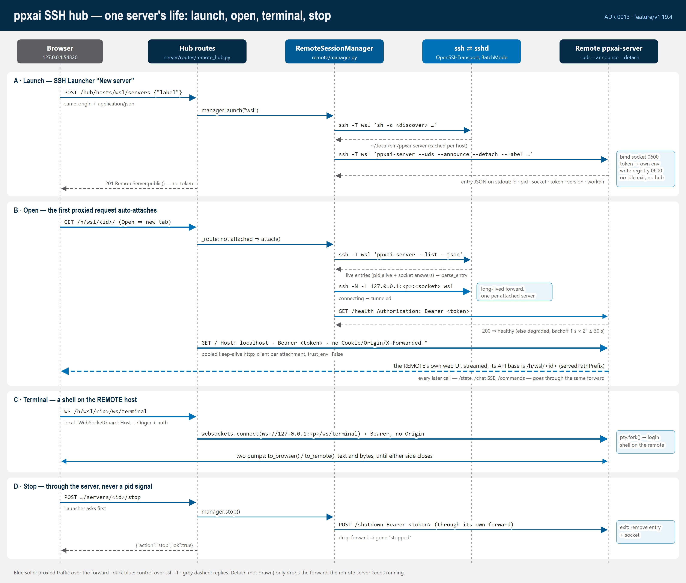

# SSH remote hub — diagrams (ADR 0013)

Architecture infographics for the SSH hub, drawn from the code at
`feature/v1.19.4` (phases 1–5). Each diagram is an **SVG source** plus a
**PNG** rendered from it at 2×.

| Diagram | Shows |
|---|---|
| [ssh-hub-architecture](ssh-hub-architecture.svg) ([PNG](ssh-hub-architecture.png)) | The local flow and the hub flow side by side: browser, local `ppxai-server` lanes (local routes, `/hub/*`, `/h/<host>/<id>/…`), the `ssh` processes, and the remote `ppxai-server` behind its private unix socket |
| [ssh-hub-sequence](ssh-hub-sequence.svg) ([PNG](ssh-hub-sequence.png)) | One server's life: launch (`ssh -T … --uds --announce --detach`), open (auto-attach, `ssh -N -L`, `/health`, proxied UI), terminal websocket, stop (`POST /shutdown`) |
| [ssh-attachment-states](ssh-attachment-states.svg) ([PNG](ssh-attachment-states.png)) | `RemoteSessionManager`'s states and every transition in `ALLOWED_TRANSITIONS` |





## Editing

Edit the SVG, then regenerate the PNGs:

```bash
node scripts/render-svg-diagrams.js docs/diagrams/ssh-remote
```

The script uses the Playwright Chromium that `tests/e2e` installs
(`npm install` there once). The PNG is always regenerated from the SVG; never
edit it by hand.

Style: navy/blue palette (`#032B46` headers, `#0072B8` / `#005A93`
emphasis, `#62B2E0` / `#A1D4F0` fills, `#5D5D60` / `#98989B` muted,
`#F2F2F3` page), fonts `'IBM Plex Sans','Segoe UI','Noto Sans',Arial,sans-serif`
and the IBM Plex Sans Condensed / Arial Narrow chain for headings. Every
diagram draws its own opaque background, so it reads the same in light and
dark viewers.

The walkthrough in words, with `file:line` anchors, is
[../../remote-ssh-call-graphs.md](../../remote-ssh-call-graphs.md).
