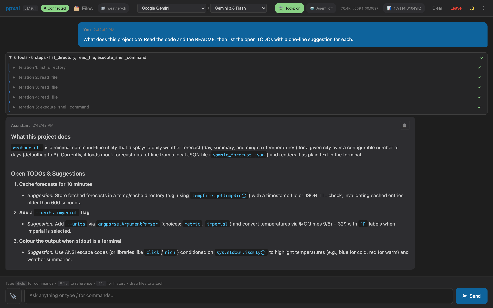

# ppxai Documentation

**One AI workbench, any model, on your machine.** Chat, edit code, and run background tasks against Gemini, OpenAI, OpenRouter, Anthropic, or a local model — from the web app, VSCode, or a terminal UI.

[](https://github.com/rcconsult/ppxai/releases)
[](https://github.com/rcconsult/ppxai/blob/master/LICENSE)



## Why ppxai?

| Problem | ppxai solution |
|---------|----------------|
| Locked to one AI vendor | Switch between Gemini, OpenAI, OpenRouter, local models anytime |
| Can't use local models | Full Ollama/vLLM support with the same interface |
| AI modifies files without asking | Consent-based safety for all file operations |
| Lost context when switching models | Conversation history carries across provider changes |
| Expensive cloud-only pricing | Mix cloud and local models per task |

## Quick start

### Installation

=== "Linux/macOS"

    ```bash
    curl -sSL https://raw.githubusercontent.com/rcconsult/ppxai/master/install.sh | bash
    ```

=== "Windows"

    ```powershell
    irm https://raw.githubusercontent.com/rcconsult/ppxai/master/scripts/install.ps1 | iex
    ```

=== "From source"

    ```bash
    git clone https://github.com/rcconsult/ppxai.git && cd ppxai
    python scripts/bootstrap.py --all
    ```

!!! warning "Not on PyPI"
    ppxai is not published to PyPI. The `ppxai` package there is an unrelated
    project, so `pip install ppxai` installs something else.

### Configure API keys

```bash
# Create ~/.ppxai/.env with your keys
GEMINI_API_KEY=xxx
OPENAI_API_KEY=sk-xxx
PERPLEXITY_API_KEY=pplx-xxx   # optional: web-search/grounding backend only, not a chat provider
```

### Run

```bash
ppxai              # Rich TUI (original)
ppxaide            # Textual TUI
ppxai-server       # HTTP server for VSCode
ppxai-desktop      # Desktop web app
```

## What you can do

### Chat with any model

- **Google Gemini** — 1M token context, search grounding; `gemini-3.8-flash` by default
- **OpenAI** — `gpt-5.6-terra` by default, plus the GPT-5.5/5.4 lines and GPT-5.3-codex
- **Anthropic (Claude)** — opt-in via the `[anthropic]` extra; ships untested against the live API
- **OpenRouter** — 100+ models including Claude
- **Local models** — Ollama, vLLM, LMStudio

Switch providers or models mid-session with `/provider` / `/model` without losing conversation history.

### Let it work on your code

Enable autonomous multi-step task execution:

```
/auto on
```

The AI can chain tool calls, edit files, and run commands — all with your consent. Checkpoints (`/undo`) give you atomic rollback for anything it changed.

Load project-specific instructions from `AGENTS.md`:

```markdown
---
provider_hints:
  local:
    - "Complete tasks fully without stopping."
model_hints:
  "deepseek-r1*":
    - "Show reasoning before actions."
---

# Project Instructions
Python 3.11+, pytest for testing.
```

### Run work in the background

`/task "<description>" --tools <names>` launches a durable, addressable background run with its own tool grant. `/run <prompt>` is the tool-free, one-off equivalent. Both ship in all four clients; see the Task Agent Guide below.

### Work with files

Attach images, PDFs, Excel, PowerPoint, and Word files for the model to read; `/preview` opens a live-reloading HTML preview across every client.

### Use a terminal

In the web app and VSCode, `/terminal` opens a real shell pane beside the chat.

### Know what it costs

`/usage` shows token counts and cost per model; `/doctor` audits your config for stale or ineffective settings.

## Four ways to use it

| Feature | ppxai (Rich TUI) | ppxaide (Textual TUI) | VSCode | Web app |
|---------|------------------|------------------------|--------|---------|
| Streaming responses | Yes | Yes | Yes | Yes |
| Syntax highlighting | Yes | Yes | Yes | Yes |
| File editing tools | Yes | Yes | Yes | Yes |
| `/auto` agent mode | Yes | Yes | Yes | Yes |
| Checkpoint/undo | Yes | Yes | Yes | Yes |
| Markdown in chat | Limited | Full rendering | Yes | Yes |
| Themes | 4 | 17+ | N/A | N/A |
| Tab completion | Yes | Yes | Yes | Yes |

## Documentation

<div class="grid cards" markdown>

-   :material-download:{ .lg .middle } **Installation**

    ---

    Install ppxai on Linux, macOS, or Windows

    [:octicons-arrow-right-24: Installation Guide](installation.md)

-   :material-robot:{ .lg .middle } **Agents**

    ---

    Background `/task` agent platform + in-session `/auto` mode

    [:octicons-arrow-right-24: Task Agent Guide](task-agent-guide.md) ·
    [Session Agent Guide](session-agent-guide.md)

-   :material-file-document:{ .lg .middle } **Bootstrap Context**

    ---

    Project-specific AI instructions

    [:octicons-arrow-right-24: Bootstrap Context Guide](bootstrap-context-guide.md)

-   :material-cog:{ .lg .middle } **Provider Setup**

    ---

    Configure AI providers

    [:octicons-arrow-right-24: Provider Setup](provider-setup.md)

</div>

## Resources

- [GitHub Repository](https://github.com/rcconsult/ppxai)
- [Releases](https://github.com/rcconsult/ppxai/releases)
- [Issue Tracker](https://github.com/rcconsult/ppxai/issues)
- [Changelog](https://github.com/rcconsult/ppxai/blob/master/CHANGELOG.md)
- [Documentation Index](README.md) — full technical-reference list (architecture, [agent-platform call graphs](agent-platform-call-graphs.md), patterns, release notes)
