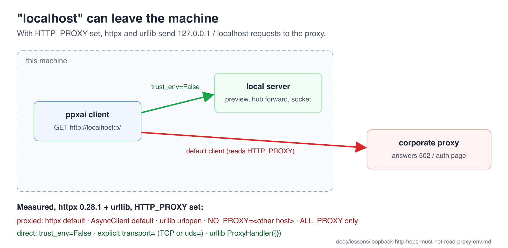

# A loopback HTTP hop must not read the proxy environment

**TL;DR:** With `HTTP_PROXY` (or `ALL_PROXY`) set, as it is on a corporate
network, httpx and urllib send requests for `127.0.0.1` and `localhost` **to
the proxy**. Neither exempts loopback on its own. A client that talks to
another local process (a local server, a preview backend, an SSH forward, a
unix socket) must pass `trust_env=False` (httpx), or an explicit `transport=`,
or an empty `ProxyHandler` (urllib).



([SVG](img/loopback-proxy-env.svg))

**Verify with:**
```bash
grep -rn "trust_env" ppxai/ --include=*.py
# Loopback clients to audit (a URL to localhost/127.0.0.1 built nearby):
grep -rn "http://localhost\|http://127.0.0.1" ppxai/ ppxai-desktop.py scripts/ --include=*.py
```

## Why this trips people up

Nobody expects "localhost" to leave the machine, and on a developer's
network `HTTP_PROXY` is usually unset, so everything works. Behind a
corporate proxy the same code fails, and not always loudly: the proxy
answers (often a 502 or an auth page), so a readiness poll that accepts any
response reports "up" for a server that does not exist.

Measured with httpx 0.28.1 and urllib (Python 3.11), `HTTP_PROXY` pointed at a
recording stand-in proxy (2026-09-29):

| Client | Proxied? |
|---|---|
| httpx default, `http://127.0.0.1:<p>/` or `http://localhost:<p>/` | **yes** |
| same, with `NO_PROXY` set to an unrelated host | **yes** |
| same, with only `ALL_PROXY` set | **yes** |
| `httpx.AsyncClient` default, `http://localhost:<p>/` | **yes** |
| urllib `urlopen("http://127.0.0.1:<p>/")` | **yes** |
| httpx with `trust_env=False` | no |
| urllib `build_opener(ProxyHandler({})).open(...)` | no |
| httpx with an explicit `transport=` (TCP or `uds=`) | no (0.28 mounts no env proxies then) |
| httpx default with `NO_PROXY=localhost,127.0.0.1` | no, but that is the user's environment, not the code's |

## What's actually true

Guarded (2026-09-29):

- `ppxai/server/routes/remote_hub.py` (the ADR 0013 hub proxy) and
  `ppxai/remote/manager.py` (its `/health` probes): `trust_env=False`, with a
  comment saying why (`96e7f58e`).
- `ppxai/server/registry.py`, `socket_answers`: an explicit
  `HTTPTransport(uds=...)`, safe on httpx 0.28 without `trust_env=False`.

**Not guarded** (loopback URL, default client), open as of 2026-09-29:

- `ppxai/server/routes/preview.py` — the `/preview` proxy to
  `http://localhost:<port>/…`: behind a proxy, every proxied request goes to
  the corporate proxy.
- `ppxai/engine/preview_backend.py`, `wait_for_port` — any response counts
  as ready, so the proxy's own reply reads as "backend is up".
- `ppxai-desktop.py`, `wait_for_server` (urllib) — gets the proxy's reply,
  not 200, and gives up after 30 s.
- `scripts/gateway-smoke.py`, `Gateway.request` (urllib).

**What to do:** give every loopback or unix-socket client `trust_env=False`
(httpx) or `urllib.request.build_opener(urllib.request.ProxyHandler({}))`
(urllib). Outbound clients are the other case: they keep the proxy
environment and take the shared TLS context, see
[outbound-http-clients-take-the-shared-tls-context.md](outbound-http-clients-take-the-shared-tls-context.md).

## Related

- ADR 0013 S5 and `docs/plan-ssh-remote-backend.md` phase 4 — the rule as
  first written for the hub
- [loopback-ui-auth-exemption.md](loopback-ui-auth-exemption.md) — the other
  way "loopback" is special in this server
