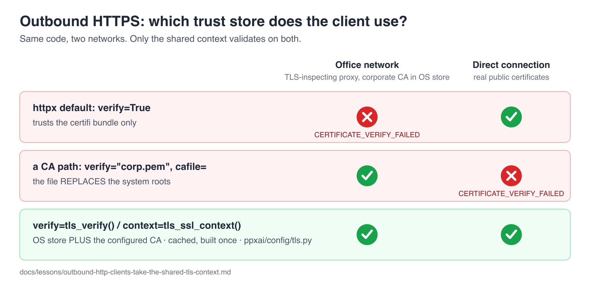

# Every outbound HTTP client takes the shared TLS context, never a library default

**TL;DR:** A new client that talks to the internet must pass
`verify=tls_verify()` (httpx, or an SDK's `http_client=`) or
`context=tls_ssl_context()` (urllib), both from `ppxai/config/tls.py`. Each
library default fails on a different network: httpx's `verify=True` trusts
**certifi only**, which breaks under a corporate TLS-inspecting proxy whose CA
is installed in the OS store; a CA **path** (`verify="<file>"`,
`create_default_context(cafile=...)`) **replaces** the system roots, which
breaks every public endpoint once the laptop leaves that network.



([SVG](img/shared-tls-context.svg))

**Verify with:**
```bash
# Outbound clients and what they pass (a multi-line call shows its verify= on a later line):
grep -rn -A3 "httpx\.\(Async\)\?Client(\|OpenAI(\|AsyncOpenAI(\|urlopen(" ppxai/ --include=*.py \
  | grep -E "verify=|http_client=|context=|transport=|trust_env"
# The helpers and their contract:
grep -n "^def tls_verify\|^def tls_ssl_context\|^def resolve_tls_verify" ppxai/config/tls.py
```

## Why this trips people up

The defaults look safe, and on the developer's own network they work. The
failure only appears on a different network, as `CERTIFICATE_VERIFY_FAILED`,
and only for the one client that took a default:

| What the client passes | Trusts | Fails where |
|---|---|---|
| nothing (httpx `verify=True`) | certifi bundle only | behind TLS inspection: the corporate CA is in the OS store, not in certifi |
| a CA path (`verify="<file>"`, `cafile=`) | that file only | off the corporate network: public certificates no longer validate |
| `tls_verify()` / `tls_ssl_context()` | OS store **plus** the configured CA | nowhere (both chains validate), or `False` when the user turned verification off |

"Verified on this host" in the docstrings is real: a cafile-only context fails
against `api.perplexity.ai` on a direct connection, while default-plus-CA
passes (`ppxai/config/tls.py`, `tls_ssl_context`).

A second, quieter cost: httpx's default builds a fresh certifi context for
every client, about 0.75 s of CPU under OpenSSL 3.0. `tls_verify()` returns a
cached context. A readiness poll that made a client every 0.2 s paid that on
every poll (`ppxai/engine/preview_backend.py`, `wait_for_port`).

## What's actually true

- `tls_verify()` returns `False` (verification off) or an `ssl.SSLContext`,
  never `True` and never a path. `tls_ssl_context()` is the same decision for
  `ssl`/urllib callers. The resolution order is `SSL_VERIFY` →
  `SSL_CERT_FILE` → `network.ssl.verify` → `network.ssl.cert_file` → system
  store (`docs/dev-setup.md`, "Corporate proxy / TLS").
- Every outbound client in `ppxai/` passes it today: the provider clients
  (`engine/providers/base.py`, `openai_native.py`, `gemini.py`,
  `anthropic.py`), the search backends (`engine/search/`), `/doctor`'s probe,
  the context fetcher, the multimodal sidecar, the web tools (urllib) and
  the preview proxy. How it got there: `ccdd0f3f` (the CA is added, not
  substituted), `7c82c95e`, `f975c4ec` (`/doctor` probed with its own
  default), `42bbabea` (google-genai built its own context; four more clients
  moved to the cached one).
- Coverage is uneven: the additive-CA guarantee is pinned by tests only on
  hosts whose store is a cafile (debt Item 72).

**What to do:** in a new client, import `tls_verify` (or `tls_ssl_context` for
urllib) and pass it. For an SDK, build its `http_client` with it. A loopback or
unix-socket hop is not outbound; see
[loopback-http-hops-must-not-read-proxy-env.md](loopback-http-hops-must-not-read-proxy-env.md).

## Related

- `ppxai/config/tls.py` — `tls_verify`, `tls_ssl_context`, `resolve_tls_verify`
- `docs/dev-setup.md` — "Corporate proxy / TLS"
- `docs/debt-inventory.md` — Item 72
