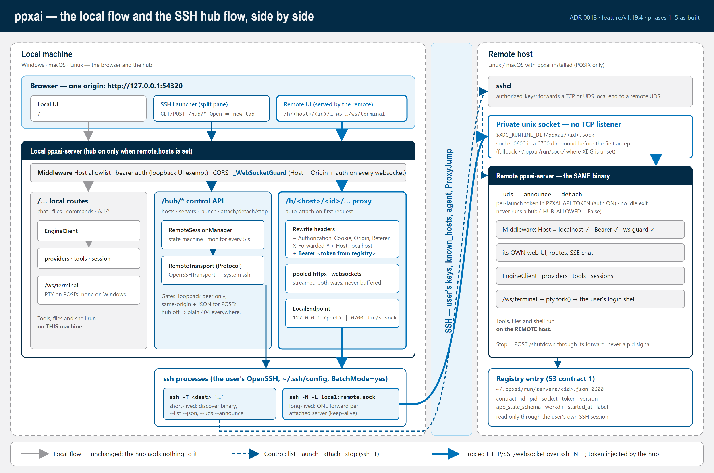
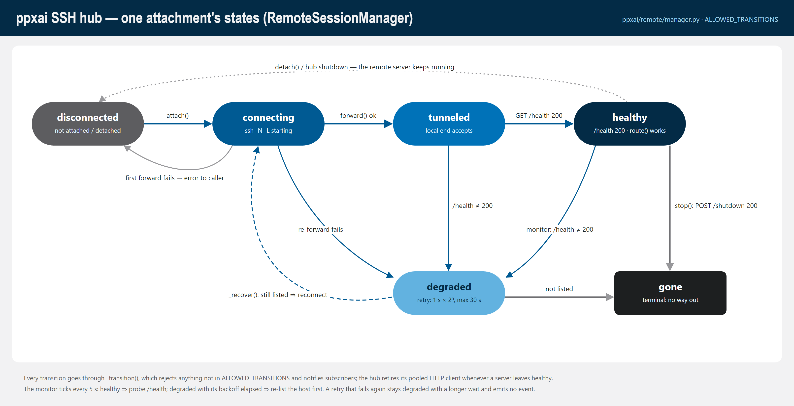

# Remote SSH hub — call graphs (ADR 0013)

**Traced from code at `feature/v1.19.4` @ `37266817` (2026-09-28).** Phases
1–5 are implemented (phase 5 = the web client: prefix recognition and the SSH
Launcher). Phase 6, the owner trial, is still to do.

**Purpose:** a map of what each hub path actually calls, from the browser to a
shell on the remote host, next to the plain local flow it sits beside. Use it
for debugging (where did this request go?), for security review (where is the
token injected, and where is it dropped?), and for onboarding.

**Maintenance rule:** a phase that adds or changes a hub path updates this doc
in the same commit. The code is the source of truth. If a graph and the code
disagree, fix the graph.

- **Design:** [decisions/0013-ssh-remote-backend.md](decisions/0013-ssh-remote-backend.md)
- **Plan and per-phase status:** [plan-ssh-remote-backend.md](plan-ssh-remote-backend.md)
- **Diagrams (SVG + PNG):** [diagrams/ssh-remote/](diagrams/ssh-remote/README.md)
- **Where it sits in the whole system:** [architecture.md § Remote SSH hub](architecture.md#remote-ssh-hub-adr-0013)



---

## The spine: two processes, one browser origin

The hub is **not a separate program**. It is the local `ppxai-server`, which
turns the hub on when `remote.hosts` names at least one host. Each remote
server is **the same `ppxai-server` binary**, started with `--uds --announce
--detach`. The hub reaches it through the user's own `ssh`.

```
 browser  ── http://127.0.0.1:54320 ──┬── /…                 local flow (unchanged)
                                      │     middleware → routes → EngineClient → providers/tools (LOCAL)
                                      │
                                      ├── /hub/*               control API   [server/routes/remote_hub.py]
                                      │     RemoteSessionManager            [remote/manager.py]
                                      │       └─ RemoteTransport (Protocol) [remote/transport.py]
                                      │            └─ OpenSSHTransport      [remote/openssh.py]
                                      │                 ssh -T  … "ppxai-server --list --json" / --uds --announce --detach
                                      │
                                      └── /h/<host>/<id>/…     reverse proxy [server/routes/remote_hub.py]
                                            httpx / websockets  →  LocalEndpoint (127.0.0.1:<port> | 0700 dir/s.sock)
                                              ssh -N -L <local>:<remote socket>          (one long-lived forward per server)
                                                → remote sshd → /run/user/<uid>/ppxai/<id>.sock (0600)
                                                  → remote ppxai-server: middleware → routes → EngineClient → tools (REMOTE)
```

Invariants this layering enforces. Check them when refactoring:

- **`ppxai/remote/` never interprets a chat.** It imports nothing from
  `ppxai.engine` or `ppxai.commands` (fenced in
  `tests/test_no_new_lazy_imports.py`). It moves bytes and manages forwards.
- **The token never reaches the browser.** The hub reads it from the remote's
  registry entry (over SSH) and injects `Authorization: Bearer` on every
  upstream request. `RemoteServer.public()` and its `repr` omit it.
- **Off means absent.** Without `remote.hosts` there is no `Hub`, no manager,
  no `ssh` process, and every `/hub/*` and `/h/*` path answers the byte-identical
  Starlette 404. `tests/test_remote_hub_coder_fence.py` pins this for the k8s
  coder pods.
- **A remote server never runs a hub.** `_run_announced()` sets
  `_HUB_ALLOWED = False` before the lifespan runs.
- **Every tool runs on the machine that owns the server.** The hub proxies the
  remote's own web UI and API, so shell, files, preview, `/task` and the
  terminal all execute on the remote host. Nothing in the hub touches a tool.

---

## 1. Local server startup: turning the hub on

```
lifespan(app)                                          [server/http.py:130]
├─ initialize() … SessionManager … idle monitor        (unchanged local startup)
├─ get_agent_run_registry()                            (restart sweep)
├─ if _HUB_ALLOWED:                                    (False on an announced server)
│   └─ start_hub(get_remote_config())                  [routes/remote_hub.py:161]
│       ├─ get_remote_config()                         [config/remote.py:15] → raw `remote` block, {} if absent
│       ├─ parse_hosts(remote)                         [remote/inventory.py:47]
│       │   └─ InventoryError → log + print "Remote hub: disabled -- …" → return None   (server still starts)
│       ├─ no hosts → return None                      (hub off: every hub path is a plain 404)
│       ├─ RemoteSessionManager(hosts)                 [remote/manager.py:170]
│       │   └─ transport_factory default: lambda h: OpenSSHTransport(h.ssh)
│       ├─ manager.start_monitor(5.0)                  [manager.py:472] → asyncio task: tick() every 5 s
│       └─ _hub = Hub(manager)                         [routes/remote_hub.py:101]
│           └─ manager.subscribe(Hub._on_change)       (retire a pooled client when a server leaves HEALTHY)
│       print "Remote hub: <ids> (under /h/<host>/<server>/)"
└─ yield … → stop_hub()                                [routes/remote_hub.py:189]
    └─ Hub.close() → close pooled clients → manager.close()
        └─ cancel monitor; detach every attachment (forwards dropped, remote servers KEEP running)
```

`remote` is a fourth top-level config axis, beside ADR 0010's three. The loader
keeps it through its top-level whitelist.

---

## 2. Remote side: `ppxai-server --uds --announce --detach` (S3)

Run on the remote host by the hub's `launch()` (§4), or by hand.

```
main()                                                 [server/http.py]
└─ args.uds / --announce / --detach → _run_announced(args)   [http.py:986]
    ├─ refuse: --detach w/o --announce; --announce w/o --uds; --reload; Windows (POSIX only)
    ├─ _announced_workdir()                            [http.py:1060]
    │   └─ PPXAI_LAUNCH_CWD (set by the frozen entry script, ppxai-server.py:15,
    │      before it chdirs to the binary's directory) → os.chdir(workdir)
    ├─ registry.new_server_id(); default_socket_path(id)  → $XDG_RUNTIME_DIR/ppxai/<id>.sock
    ├─ _detach() (--detach)                            [http.py:1087] fork; the launcher waits on a pipe for the JSON
    ├─ registry.bind_uds(socket_path)                  [registry.py:213] 0700 dir, socket 0600 BEFORE the first accept
    ├─ _HUB_ALLOWED = False
    ├─ --announce: token = new_token() → os.environ["PPXAI_API_TOKEN"]; _IDLE_TIMEOUT_OVERRIDE = 0
    ├─ initialize(); make sure the secret chain reads PPXAI_API_TOKEN (auth ON for socket requests)
    ├─ registry.build_entry(...) → write_entry()       [registry.py:84, :119] ~/.ppxai/run/servers/<id>.json, 0600
    │   {contract:2, id, pid (THIS process), socket, token, version, app_state_schema, workdir, started_at, label}
    ├─ _report(fd, entry)                              → JSON to stdout / to the waiting launcher
    └─ uvicorn on fd=sock.fileno()                     (serves until POST /shutdown or a signal)
        finally: remove_entry(id); unlink(socket)
```

`ppxai-server --list --json` → `registry.list_live(prune=True)`
(`registry.py:192`): only entries whose pid is alive **and** whose socket
answers `/health` **with the entry's token** (the announced server's `/health`
is not auth-exempt). Dead entries are deleted.

---

## 3. Control API: `GET /hub/hosts`, `GET /hub/hosts/<host>/servers`

```
hub_hosts(request)                                     [routes/remote_hub.py:236]
├─ _gate(request)                                      [:205] hub on AND _is_loopback(peer, no forwarding headers)
│   └─ else → _not_found()                             (Starlette-identical 404)
└─ {"hosts": manager.hosts()}                          (id, ssh, last transport error, attachments; no tokens)

hub_servers(request, host)                             [:244]
├─ _gate → 404
└─ manager.servers(host)                               [manager.py:276]
    ├─ _host(host_id) → UnknownHostError (404)
    ├─ _resolve_binary(host)                           [:248] cached per host
    │   └─ _run(host, ["sh","-c",_DISCOVER_SCRIPT,"sh", <ppxai_server> | "ppxai-server", "~/.local/bin/ppxai-server"])
    │       └─ OpenSSHTransport.run(argv, timeout=30)  [openssh.py:221]
    │           └─ ssh -o BatchMode=yes -o ConnectTimeout=N -T <dest> '<argv quoted once>'
    │       rc≠0 → ServerNotInstalledError (409)
    ├─ _run(host, [binary, "--list", "--json"])
    │   └─ rc≠0 → _refuse_if_unsupported(): argparse usage error (rc 2) → UnsupportedServerError (409, names --version + the hub's version)
    └─ for each entry: parse_entry(host, raw) → parse_contract()   [remote/contract.py]
        ├─ retired (1) / unknown `contract` → RetiredContractError / UnknownContractError  ┐ collected in `refused`,
        └─ bad field / non-POSIX socket path → Malformed ┘ the rest still listed
   → {"servers": [RemoteServer.public()…], "refused": [...]}
```

Transport failures map to typed errors from OpenSSH's stderr
(`classify_ssh_failure`, `openssh.py:106`): `HostUnreachableError`,
`AuthFailedError`, `HostKeyRejectedError`, `ForwardFailedError`,
`TransportTimeoutError` → **502**, with the stderr in `detail`.

---

## 4. `POST /hub/hosts/<host>/servers` — launch

```
hub_launch(request, host)                              [routes/remote_hub.py:265]
├─ _gate → 404
├─ _control_refusal(request)
│   ├─ _cross_site(): Sec-Fetch-Site cross-site/same-site, or Origin ≠ own host → 403
│   └─ Content-Type not application/json → 415   (forces a CORS preflight for any browser caller)
├─ body {"workdir"?, "label"?}: single-line strings only → else 400
└─ manager.launch(host, workdir, label)               [manager.py:297]
    ├─ _resolve_binary(host)
    ├─ _check_contract(): _run(host, [binary, "--registry-contract"]) BEFORE anything starts
    │   ├─ rc 2 (no such flag: 1.19.3, pre-contract-2 builds) → UnsupportedServerError (409)
    │   ├─ not a number → MalformedEntryError; retired/unknown → Retired/UnknownContractError (409)
    │   └─ contract 2 → go on
    ├─ argv = [binary, "--uds", "--announce", "--detach", ("--label", label)]
    ├─ workdir → ["sh","-c",_CD_EXEC_SCRIPT,"sh", workdir, *argv]   ("~" = remote $HOME)
    ├─ _run(host, argv, launch_timeout=90)  →  §2 runs on the remote host
    ├─ rc≠0 and payload {"error"} → RemoteCommandFailedError; old server → UnsupportedServerError
    └─ parse_entry(host, stdout JSON) → RemoteServer
   → 201 RemoteServer.public()
```

Launching does **not** attach. The first proxied request does (§5).

---

## 5. `GET|POST … /h/<host>/<id>/<path>` — the HTTP proxy

The remote server's own web UI and every API call it makes. The UI keeps its
API base inside the prefix: `servedPathPrefix()` (`web/app.js:82`) returns
`/h/<host>/<id>` (or the k8s `/s/<slug>`), so `ApiClient`, `StreamHandler` and
the terminal view all build URLs under it.

```
proxy_http(request, host, server_id, path)             [routes/remote_hub.py:371]
├─ _gate → 404
├─ non-GET/HEAD/OPTIONS and _cross_site() → 403
├─ _route(hub, host, server_id)                        [:315]
│   ├─ HOST_ID_RE / SERVER_ID_RE / host in inventory → else 404 (never a forward)
│   ├─ manager.route(host, id)                         [manager.py:330] (endpoint, token) only if HEALTHY
│   ├─ request has `X-Ppxai-Hub-Attach: no` → may_attach=False → skip to the 503 below
│   │   (the SSH Launcher's count reads: an observer never opens a forward; header not forwarded)
│   ├─ no attachment yet → manager.attach(host, id)    ── auto-attach on first use ──┐
│   │                                                                                │
│   │   attach(host, id)                               [manager.py:344]              │
│   │   ├─ per-(host,id) asyncio.Lock; existing → no-op                              │
│   │   ├─ _find() → servers(host) → the RemoteServer (with token) → else 404        │
│   │   └─ _connect(att, initial=True)                 [:361]                        │
│   │       ├─ DISCONNECTED → CONNECTING                                             │
│   │       ├─ transport = factory(host)  (a NEW OpenSSHTransport per attachment)    │
│   │       ├─ transport.forward(entry.socket)         [openssh.py:249]              │
│   │       │   ├─ POSIX: LocalEndpoint("uds", mkdtemp(0700)/s.sock)                 │
│   │       │   │   Windows: LocalEndpoint("tcp", "127.0.0.1:<free port>")           │
│   │       │   ├─ ssh -o BatchMode=yes -o ConnectTimeout=N -o ExitOnForwardFailure=yes
│   │       │   │      [-o StreamLocalBindMask=0177 -o StreamLocalBindUnlink=yes]    │
│   │       │   │      -N -L <local>:<remote socket> <dest>                          │
│   │       │   ├─ drain stderr for the forward's whole life                         │
│   │       │   └─ _wait_ready(): poll "local end accepts"; ssh exited → typed error │
│   │       ├─ fail → DISCONNECTED + raise (502)                                     │
│   │       ├─ CONNECTING → TUNNELED                                                 │
│   │       └─ http_request(endpoint, token, GET /health)   [manager.py:106]         │
│   │           200 → HEALTHY   else → DEGRADED (backoff 1 s × 2ⁿ, max 30 s)         │
│   └─ still not HEALTHY → 503 {"state", "why"} + Retry-After: 5  ◀─────────────────┘
├─ client = hub.client_for(host, id, endpoint)         [:113] one pooled keep-alive httpx client per attachment
│                                                       (ADR 0013 Q4: ~120 ms per new SSH channel), trust_env=False
├─ upstream headers = request headers
│     − hop-by-hop, Host, Authorization, Cookie, Origin, Referer, Forwarded, X-Forwarded-*, X-Real-IP
│     + Host: localhost  + Authorization: Bearer <registry token>
├─ client.send(build_request(method, "/"+path+query, content=request.stream()), stream=True)
│   └─ httpx.HTTPError → 502 remote_unreachable
│
│   ─── over the forward ──▶ remote ppxai-server (the unchanged local stack, on the remote host)
│        host_validation_middleware: Host localhost ✓ (loopback bind semantics)
│        auth middleware: Bearer token ✓ (PPXAI_API_TOKEN from --announce)
│        route → EngineClient → providers / tools — all on the REMOTE host
│
└─ StreamingResponse(upstream.aiter_raw())            never buffered: SSE and chunked bodies stream through
    downstream headers − hop-by-hop; relative Location and Set-Cookie Path get the /h/<host>/<id> prefix;
    repeated Set-Cookie kept (raw_headers)
```

`GET /h/<host>/<id>` (no trailing slash) → 307 to `/h/<host>/<id>/`, so the
remote UI's relative asset URLs resolve inside the prefix.

---

## 6. `WS /h/<host>/<id>/ws/terminal` — the terminal through the hub

```
proxy_websocket(websocket, host, server_id, path)      [routes/remote_hub.py:405]
│   (first, the LOCAL server's _WebSocketGuard [http.py:512] has already vetted
│    the browser's handshake: Host allowlist, Origin loopback/own, auth gate)
├─ _gate + _cross_site → close 1008
├─ _route() (as §5, auto-attach) → 404: close 1008; not healthy: close 1011
├─ upstream = uds: websockets.unix_connect(endpoint, "ws://localhost/<path>?<query>")
│             tcp: websockets.connect("ws://<127.0.0.1:port>/<path>?<query>")
│   additional_headers = [Authorization: Bearer <token>], proxy=None, NO Origin
│   └─ fails → close 1011
├─ websocket.accept()
└─ two pumps until either side ends: to_browser() / to_remote()   (text and bytes)

   remote side: _WebSocketGuard (no Origin = non-browser client; bearer ✓)
                → websocket_terminal()                 [routes/terminal.py:203]
                → pty.fork() → the user's login shell ON THE REMOTE HOST
```

On a Windows **hub** this gives a real Linux shell, because the PTY lives on
the remote. A Windows **local** server still has no terminal backend (debt
Item 84).

---

## 7. Detach, stop, and the monitor

```
POST /hub/hosts/<h>/servers/<id>/attach|detach|stop    [routes/remote_hub.py:290]
├─ _gate → 404; unknown action → 404; _control_refusal → 403/415
├─ attach → manager.attach()  (§5)
├─ detach → manager.detach()                           [manager.py:394]
│   └─ pop attachment → transport.close() (kill ssh -L, remove private dir) → DISCONNECTED "detached"
│      the REMOTE SERVER KEEPS RUNNING
└─ stop   → manager.stop()                             [manager.py:404]
    ├─ not attached → attach() first
    ├─ not HEALTHY → RemoteCommandFailedError (cannot ask it to stop)
    ├─ http_request(endpoint, token, POST /shutdown)   through the server's own forward, never a pid signal
    │   (a PyInstaller binary's visible pid is a bootloader; the registry pid is os.getpid() inside the server)
    └─ drop forward → GONE "stopped"   (the remote removes its own entry + socket on exit)

monitor: start_monitor() → every 5 s tick()            [manager.py:432]
├─ HEALTHY: GET /health through the forward; ≠200 → DEGRADED
└─ DEGRADED and backoff elapsed: _recover()            [:448]
    ├─ servers(host) fails → stay DEGRADED, longer backoff, no event
    ├─ server no longer listed → GONE "no longer in the host's registry"
    └─ listed → drop the old forward, _connect(initial=False) → TUNNELED → HEALTHY | DEGRADED
```

Every transition goes through `_transition()`, which checks
`ALLOWED_TRANSITIONS` and notifies subscribers. The hub's `_on_change` retires
the pooled HTTP client whenever a server leaves `HEALTHY`.



---

## 8. Web client (phase 5): the SSH Launcher and the remote page

```
local page  http://127.0.0.1:54320/                    [web/app.js]
├─ GET /hub/hosts → 200 ⇒ show the header "SSH" button (404 ⇒ hub off, no button)
└─ SSH button → SshLauncherView in the right split pane (RightPanelFrame)
    [web/components/views/ssh-launcher-view.js]  renderSshLauncher(model, esc) is pure (tested under node)
    ├─ every 10 s: GET /hub/hosts, GET /hub/hosts/<h>/servers         (page ORIGIN, never a prefix)
    ├─ counts for HEALTHY attachments only:
    │   GET /h/<h>/<id>/sessions/list, /h/<h>/<id>/v1/agent/runs   + X-Ppxai-Hub-Attach: no
    ├─ New server → POST /hub/hosts/<h>/servers {workdir?, label?}           (§4)
    ├─ Open       → window.open("/h/<h>/<id>/", <one name per server>)        (§5, new tab)
    ├─ Detach     → POST …/<id>/detach                                        (§7)
    └─ Stop       → confirm() first → POST …/<id>/stop                        (§7)

remote page  /h/<host>/<id>/  (the REMOTE's own app.js, served through the proxy)
├─ servedPathPrefix(pathname)                          [web/app.js:82] "/h/<host>/<id>" | "/s/<slug>" | ""
│   └─ serverUrl = origin + prefix → ApiClient, StreamHandler, TerminalView all stay inside the prefix
├─ host badge + title "ppxai — <host>"
└─ Leave (handleQuit, app.js:1047) under /h/ → confirm() → POST /hub/hosts/<h>/servers/<id>/detach → "/#ssh"
    (the launcher reopens; the remote server is NEVER stopped from here)
```

---

## 9. Security checkpoints, in request order

| # | Where | Check | Refusal |
|---|---|---|---|
| 1 | local `host_validation_middleware` / `_WebSocketGuard` | Host is loopback (or `PPXAI_TRUSTED_HOSTS`) | 400 / ws 1008 |
| 2 | local `_WebSocketGuard` (`http.py:512`) | Origin is loopback, allowed, or the server's own | ws 1008 (HTTP 403) |
| 3 | `_gate` (`remote_hub.py:205`) | hub on, peer is loopback with no forwarding headers | 404 (as if off) |
| 4 | `_cross_site` (`:212`) | writes, websockets, control POSTs are same-origin | 403 / ws 1008 |
| 5 | `_control_refusal` (`:255`) | control POSTs are `application/json` | 415 |
| 6 | `_route` (`:315`) | host id / server id pattern, host in inventory | 404, never a forward |
| 7 | `OpenSSHTransport` | `BatchMode=yes`, user's `known_hosts`, destination never starts with `-` | typed 502 |
| 8 | forward local end | POSIX: socket 0600 in a 0700 `mkdtemp` dir; Windows: 127.0.0.1 only | — |
| 9 | remote socket | 0600 in a 0700 dir, no TCP listener | other users can't connect |
| 10 | remote auth | per-launch bearer token, injected by the hub only | 401 |
