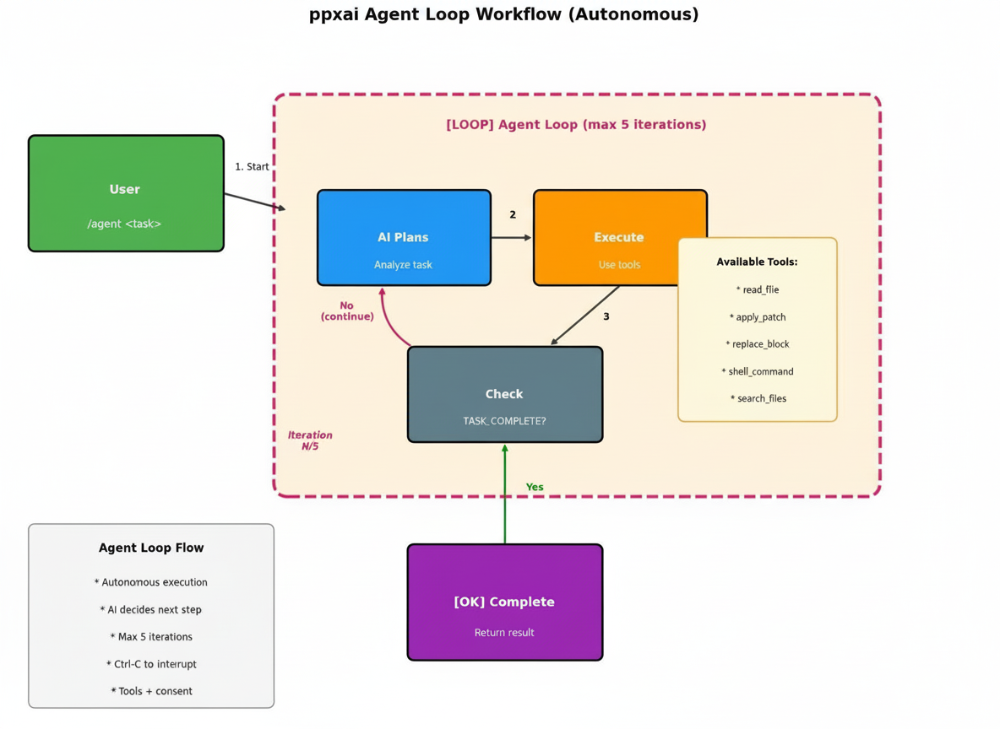

# Session Agent Mode User Guide (`/auto`)

**Applies to**: v1.14.2+ (agent mode introduced v1.13.0; this guide tracks the v1.14.2+ shape)
**Status**: Production Ready
**Last verified against**: v1.19.1 (command renamed `/agent` → `/auto` per ADR 0011 — **no alias**; behavior unchanged)
**Renamed** from `agent-mode-guide.md` (v1.19.0) to disambiguate the three agent surfaces.

> **⚠️ Three different "agents" — this guide covers only the first:**
>
> | Surface | What it is | Where documented |
> |---|---|---|
> | **`/auto` session mode** (this guide) | The IN-SESSION iterative loop: your current chat session plans + executes tools turn by turn, inside the session's context and working dir. | here |
> | **`/run` one-off runs** | One-off background runs (`POST /v1/agent/run`, `kind=oneshot`): a single prompt answered by a per-run provider/model; grant is config-decided (`execution.run.web_search` on → web_search only, off → closed-book); held result. All clients. | [api-gateway.md](api-gateway.md) §`/v1/agent/*` |
> | **`/task` sub-agent platform** (v1.19.0) | Tool-CAPABLE, sandboxed, durable background runs (`POST /v1/agent/task`): capability grants (`--tools`), spec/skill files, egress allowlists, budgets, consent parks, held results, resume. All clients (the Rich TUI reads but cannot `launch`/`resume`). | [agent-task-command-design.html](agent-task-command-design.html), [api-gateway.md](api-gateway.md) |
>
> If you want a background agent that reads/edits files under a grant, you want **`/task`**, not this mode.

This guide explains how to use autonomous agent mode for multi-step task execution. Agent mode works with both **ppxai** (Rich TUI) and **ppxaide** (Textual TUI).

---

## Table of Contents

1. [Overview](#overview)
2. [Getting Started](#getting-started)
3. [Commands Reference](#commands-reference)
4. [Research Workflows](#research-workflows)
5. [Development Workflows](#development-workflows)
6. [VSCode Extension](#vscode-extension)
7. [Best Practices](#best-practices)
8. [Troubleshooting](#troubleshooting)

---

## Overview

Agent mode transforms the TUI from a turn-based chat assistant into an autonomous developer agent. Instead of requiring manual direction for each step, the agent can:

- **Plan** - Analyze tasks and create execution strategies
- **Execute** - Use tools to read, edit files, and run commands
- **Verify** - Check results and iterate until complete
- **Report** - Summarize what was accomplished

### How It Works



1. You issue an `/auto <task>` command
2. The agent enters an autonomous loop (max 10 iterations by default)
3. Each iteration: Plan → Execute tools → Check completion
4. Loop continues until:
   - AI signals `TASK_COMPLETE:` (success)
   - Max iterations reached (configurable, default: 10)
   - User interrupts with Ctrl-C

### Comparison: Turn-Based vs Agent Mode

| Aspect | Turn-Based (Default) | Agent Mode |
|--------|---------------------|------------|
| User involvement | Every step | Initial task only |
| Tool calls | Single per turn | Multiple per iteration |
| Iterations | Manual | Automatic (up to 10) |
| Best for | Simple queries | Multi-step tasks |

---

## Getting Started

### Prerequisites

1. Tools must be available (they are auto-enabled with agent mode)
2. For file editing, you'll need to approve edits (consent system)

### Quick Start

```bash
# Start ppxai (Rich TUI) or ppxaide (Textual TUI)
ppxai    # or ppxaide

# Enable agent mode (optional - auto-enabled when using /auto)
/tools auto on

# Run an autonomous task
/auto Fix the failing test in test_auth.py
```

### Your First Agent Task

Try this simple task to see agent mode in action:

```bash
/auto Create a hello.py file that prints "Hello, Agent Mode!"
```

The agent will:
1. Analyze the task
2. Use `insert_text` tool to create the file
3. Signal completion with a summary

---

## Commands Reference

### `/auto <task>` - Run Autonomous Task

The main command for agent mode. Runs an autonomous loop until the task is complete.

**Syntax:**
```bash
/auto <task description>
```

**Examples:**
```bash
# Simple file creation
/auto Create a Python script that calculates fibonacci numbers

# Bug fixing
/auto Fix the TypeError in utils.py line 42

# Code review with context
/auto Review @git changes and fix any issues

# Refactoring with structure awareness
/auto Reorganize the API module based on @tree
```

**Interrupt:** Press `Ctrl-C` at any time to stop the agent loop.

### `/tools auto` - Manage Agent Mode

Enable, disable, or check agent mode status.

**Syntax:**
```bash
/tools auto          # Show current status
/tools auto on       # Enable agent mode
/tools auto off      # Disable agent mode
```

**Notes:**
- Enabling agent mode automatically enables tools
- Agent mode is session-scoped (resets on restart)

### Context Providers with Agent Mode

Agent mode works seamlessly with context providers:

| Provider | Description | Example |
|----------|-------------|---------|
| `@file` | Include file contents | `/auto Refactor @auth.py` |
| `@git` | Include git diff | `/auto Review @git and fix issues` |
| `@tree` | Include project structure | `/auto Suggest improvements for @tree` |
| `@clipboard` | Include clipboard text (v1.14.2+) | `/auto Debug this error @clipboard` |
| `@url` | Fetch web content (v1.14.2+) | `/auto Summarize @https://docs.example.com` |

**Combined usage:**
```bash
/auto Review my changes @git in the context of @tree and fix any bugs

# Debug an error from clipboard
/auto Analyze this stack trace @clipboard and suggest fixes

# Implement based on documentation
/auto Implement the API from @https://api.example.com/spec.json
```

---

## Research Workflows

Agent mode excels at research and analysis tasks that require multiple steps.

### Codebase Analysis

```bash
# Find and explain a pattern
/auto Find all uses of the Observer pattern in this codebase and explain how they work

# Security audit
/auto Analyze @tree for potential security issues and list them

# Dependency analysis
/auto Review the imports in @main.py and identify any unused or deprecated dependencies
```

### Code Review Workflow

```bash
# Review staged changes
/auto Review @git changes for bugs, security issues, and style problems

# Compare with design doc
/auto Compare my implementation @git against the spec in DESIGN.md
```

### Documentation Research

```bash
# Generate documentation
/auto Read @utils.py and generate comprehensive docstrings for all functions

# Update outdated docs
/auto Compare @README.md with the current @tree structure and update outdated sections
```

---

## Development Workflows

Agent mode is powerful for development tasks that span multiple files.

### Bug Fixing

```bash
# Single file fix
/auto Fix the failing test in test_auth.py

# Multi-file fix
/auto The login fails with 401 - find the cause in auth.py and fix it

# With test verification
/auto Fix the bug in parser.py and verify the tests pass
```

### Feature Implementation

```bash
# Simple feature
/auto Add a --verbose flag to the CLI

# Multi-step feature
/auto Implement user session management with tests

# With context
/auto Based on @tree, add a caching layer in the appropriate location
```

### Refactoring

```bash
# Rename across files
/auto Rename the class 'OldName' to 'NewName' in all files

# Extract function
/auto Extract the validation logic from auth.py into a separate validator.py

# Restructure
/auto Based on @tree, move utility functions from main.py to utils.py
```

### Test Development

```bash
# Generate tests
/auto Generate unit tests for @calculator.py

# Fix failing tests
/auto Fix all failing tests in tests/test_api.py

# Add test coverage
/auto Add edge case tests for the parse_date function in utils.py
```

---

## VSCode Extension

The VSCode extension provides a graphical interface for agent mode.

### Agent Toggle Button

In the ppxai chat panel, you'll see an **Agent** button next to the **Tools** button:

- **Gray (OFF)**: Agent mode disabled
- **Purple (ON)**: Agent mode enabled

Click to toggle. When enabled, tools are automatically enabled.

### Using Agent Mode in VSCode

1. Click the **Agent** button to enable agent mode
2. Type your task in the chat input
3. The agent will execute autonomously
4. Watch the streaming output for progress
5. Use Esc or the stop button to interrupt

### HTTP API Endpoints

If using the HTTP server directly:

```bash
# Check status
curl http://127.0.0.1:54320/agent/status

# Enable
curl -X POST http://127.0.0.1:54320/agent/enable

# Disable
curl -X POST http://127.0.0.1:54320/agent/disable
```

---

## Best Practices

### Writing Effective Tasks

**Be specific:**
```bash
# Good - specific target and action
/auto Fix the TypeError on line 42 of utils.py

# Less effective - vague
/auto Fix bugs
```

**Include context:**
```bash
# Good - context provided
/auto Review @git changes for security issues in the auth module

# Less effective - missing context
/auto Check for security issues
```

**Define success criteria:**
```bash
# Good - clear completion criteria
/auto Implement user validation and ensure all tests pass

# Less effective - unclear when done
/auto Add validation
```

### Managing Consent

The agent requires consent for file edits:

| Response | Effect |
|----------|--------|
| `y` (yes) | Allow this specific file edit |
| `n` (no) | Deny this edit |
| `always` | Allow all edits this session (autonomous mode) |
| `never` | Block all edits this session |

**Tip:** For fully autonomous execution, respond `always` to the first consent prompt.

### Handling Interrupts

- **Ctrl-C (once)**: Gracefully stops the current iteration
- **Ctrl-C (twice within 2s)**: Force stops immediately

After interrupting, the agent will summarize progress made.

### Iteration Limits

The default max is 10 iterations (configurable via `tools.agent.max_iterations`). If your task needs more:

1. Let the agent complete its iterations
2. Review the output
3. Run `/auto continue` or issue a follow-up task

---

## Configuration

Agent mode behavior can be customized in `ppxai-config.json`:

```json
{
  "tools": {
    "agent": {
      "max_iterations": 10,
      "context_char_limit": 2000,
      "min_task_words": 3
    }
  }
}
```

### Bootstrap Context for Agents (v1.14.0)

You can provide agent-specific guidance via `AGENTS.md` bootstrap files. This is especially useful for:
- Guiding agent behavior based on provider/model capabilities
- Setting project-specific coding standards
- Improving small model performance with targeted hints

**Example AGENTS.md for agent workflows:**

```markdown
---
provider_hints:
  local:
    - "Complete tasks fully without stopping on empty responses."
    - "Use tools proactively - don't ask for permission."
    - "When editing files, make all changes in a single edit_file call."
  ollama:
    - "Keep responses concise - limited context window."
    - "Prefer smaller, focused tool calls over complex multi-step operations."
model_hints:
  "qwen2.5-coder:3b":
    - "Focus on code quality and correctness."
    - "Use edit_file for surgical changes, write_file only for new files."
  "deepseek-r1*":
    - "Show your reasoning process before taking actions."
    - "Think step-by-step for complex problems."
---

# Project: My App

## Agent Guidelines
- Run tests after making changes: `pytest tests/ -v`
- Follow PEP 8 style guidelines
- Add docstrings to new functions

## Code Standards
- Python 3.11+, type hints required
- Use dataclasses for data structures
```

Use `/context hints` to see which hints are active for your current provider/model.

See [Bootstrap Context Guide](bootstrap-context-guide.md) for full documentation.

### Configuration Options

| Setting | Default | Description |
|---------|---------|-------------|
| `max_iterations` | 10 | Maximum autonomous loop iterations before stopping |
| `context_char_limit` | 2000 | Character limit for context display in tool results |
| `min_task_words` | 3 | Minimum word count required for agent tasks |

### Why These Settings Exist

**`max_iterations`**: Prevents runaway agent loops that could consume excessive API tokens or run indefinitely. The default of 10 balances giving the agent enough room to complete complex tasks while preventing infinite loops.

- **Lower values (3-5)**: Safer for simple tasks, uses fewer tokens, faster completion
- **Higher values (15-20)**: Allows complex multi-step tasks, but risks more API usage
- **Warning**: Values above 20 may lead to excessive token consumption

**`context_char_limit`**: Controls how much context from tool results is shown in the UI and passed back to the AI. Higher limits provide more context for accurate decisions but increase token usage.

- **Lower values (500-1000)**: Faster, cheaper, but may miss important details
- **Higher values (3000-5000)**: Better context retention, but more expensive
- **Warning**: Very high limits (>5000) may cause context overflow in some models

**`min_task_words`**: Safety feature that rejects vague single-word tasks. This prevents accidental dangerous actions from ambiguous commands like `/auto on` or `/auto delete`.

- **Default (3)**: Requires descriptive tasks like "Fix the bug in auth.py"
- **Lower values (1-2)**: Less safe, allows vague tasks
- **Warning**: Setting to 1 removes this safety check entirely

### Shell Command Safety

Agent mode includes built-in shell command safety patterns. These patterns are always active even without a config file:

**Dangerous patterns (require consent):**
- `rm`, `mv`, `dd`, `chmod`, `chown`, `sudo`
- `kill`, `pkill`, `killall`
- `curl | bash`, `wget | bash`

**Never-allow patterns (always blocked):**
- `rm -rf /`, `dd of=/dev/`
- Fork bombs and system-level destructive commands

You can customize these in `ppxai-config.json`:

```json
{
  "tools": {
    "shell": {
      "allowed_commands": ["^ls\\s*", "^cat\\s+"],
      "dangerous_commands": ["^rm\\s+", "^kill\\s+"],
      "never_allow": ["^rm\\s+-rf\\s+/"]
    }
  }
}
```

See [Shell Consent Guide](shell-consent-guide.md) for complete documentation.

---

## Troubleshooting

### Agent Not Starting

**Problem:** `/auto` command shows error

**Solutions:**
1. Ensure engine client is available: Check if ppxai started correctly
2. Try enabling tools manually: `/tools enable`
3. Check provider supports tools: Not all providers have tool support

### Agent Gets Stuck

**Problem:** Agent loops without making progress

**Solutions:**
1. Interrupt with Ctrl-C
2. Provide more specific instructions
3. Break the task into smaller sub-tasks

### Consent Prompts Interrupting Flow

**Problem:** Too many consent prompts

**Solutions:**
1. Respond `always` to enable autonomous file editing
2. Pre-approve directories in config (future feature)

### Max Iterations Reached

**Problem:** Task incomplete after max iterations

**Solutions:**
1. Review the agent's progress
2. Run a follow-up `/auto` command with updated context
3. Consider if the task should be split into smaller parts

### Tool Errors

**Problem:** Agent reports tool execution failed

**Solutions:**
1. Check file permissions
2. Verify the target file exists
3. Enable verbose mode: `/tools set verbose on`

---

## Examples: Complete Workflows

### Example 1: Debug and Fix

```bash
# Start agent mode
/tools auto on

# Run autonomous debugging
/auto The tests in test_parser.py are failing. Find the bug and fix it.

# Agent output:
# ━━━ Iteration 1/5 ━━━
# Analyzing test failures...
# [Uses read_file to check test_parser.py]
# Found assertion error on line 45...
#
# ━━━ Iteration 2/5 ━━━
# Reading parser.py to find the bug...
# [Uses read_file to check parser.py]
# Found issue: off-by-one error on line 78...
#
# ━━━ Iteration 3/5 ━━━
# Applying fix...
# [Uses replace_block to fix parser.py]
# [Uses execute_shell_command to run tests]
# Tests pass!
#
# ✅ Task completed!
# Summary: Fixed off-by-one error in parser.py line 78. All tests now pass.
```

### Example 2: Code Review

```bash
# Review git changes
/auto Review @git changes for bugs and security issues

# Agent output:
# ━━━ Iteration 1/5 ━━━
# Analyzing git diff...
# Found changes in: auth.py, api.py, utils.py
#
# Issues found:
# 1. SQL injection risk in api.py line 42
# 2. Hardcoded secret in auth.py line 15
# 3. Missing input validation in utils.py
#
# ━━━ Iteration 2/5 ━━━
# Fixing SQL injection...
# [Uses replace_block to parameterize query]
#
# ━━━ Iteration 3/5 ━━━
# Moving secret to environment variable...
# [Uses replace_block in auth.py]
#
# ✅ Task completed!
# Summary: Fixed 2 security issues. auth.py now uses env var, api.py uses parameterized queries.
```

### Example 3: Feature Implementation

```bash
# Implement a feature
/auto Add a --dry-run flag to the CLI that shows what would happen without making changes

# Agent iterates through:
# 1. Reading CLI entry point
# 2. Adding argument parser option
# 3. Implementing dry-run logic
# 4. Updating help text
# 5. Testing the feature
#
# ✅ Task completed!
```

---

## Related Documentation

- [Checkpoint Guide](checkpoint-guide.md) - Atomic rollback for agent tasks
- [Shell Consent Guide](shell-consent-guide.md) - Shell command security
- [Custom Tools Guide](custom-tool-development-guide.md) - Creating custom tools
- [Agentic Workflow Plan](archive/v1.15.1-completed/v1.11.0-agentic-workflow-plan.md) - Technical implementation details

---

**Agent mode introduced:** v1.13.0
